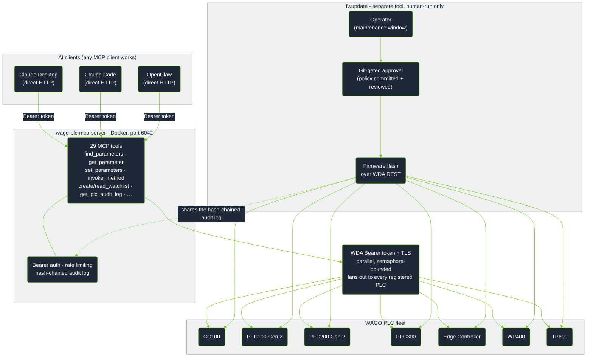
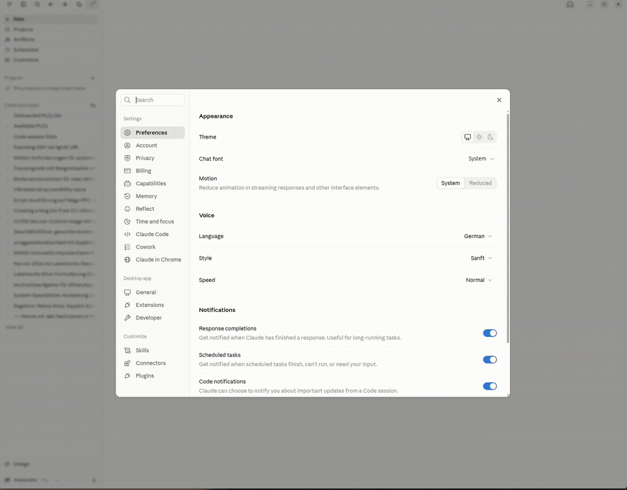

<!-- mcp-name: io.github.WagoAlex/wago-plc-mcp-server -->

[](https://hub.docker.com/r/wagoalex/wago-plc-mcp-server)
[](https://pypi.org/project/wago-plc-mcp-server/)
[](LICENSE)
[](#tool-reference)
[](#supported-hardware)
[](#supported-hardware)

# wago-plc-mcp-server

An MCP server that connects AI assistants to a fleet of WAGO PLCs.
Ask the assistant in plain English to read, configure, and monitor your controllers.
You do not need scripts or parameter IDs.

The server uses the WAGO WDA REST API. It gives the assistant 29 tools.
It has bearer authentication, a hash-chained audit log, and write gates that the agent cannot override.

## Contents

| I am a... | I want to... | Go to |
|---|---|---|
| **Claude Desktop / Claude Code user** | Connect my assistant to WAGO PLCs and ask questions | [Part 1](#part-1---claude-desktop-and-claude-code-users) |
| **Automation / OT engineer** | Know what this does to my PLCs and if it is safe | [Part 2](#part-2---automation-and-ot-engineers) |
| **Software / DevOps engineer** | Deploy it for a team with GitOps, TLS, and audit logging | [Part 3](#part-3---software-and-devops-engineers) |

Each part is complete. You do not need to read the other parts.
The [Reference](#reference) section at the end has the FAQ, compliance documents, and the license.

<details>
<summary><strong>Full table of contents</strong></summary>

- [Architecture](#architecture)
- [Part 1 - Claude Desktop and Claude Code users](#part-1---claude-desktop-and-claude-code-users)
  - [Quick start](#quick-start)
  - [Example questions](#example-questions)
  - [Demos](#demos)
- [Part 2 - Automation and OT engineers](#part-2---automation-and-ot-engineers)
  - [What this does and does not do](#what-this-does-and-does-not-do)
  - [Values you can monitor](#values-you-can-monitor)
  - [Supported hardware](#supported-hardware)
  - [Read and write rules](#read-and-write-rules)
  - [Safety gates](#safety-gates)
  - [Firmware updates](#firmware-updates)
- [Part 3 - Software and DevOps engineers](#part-3---software-and-devops-engineers)
  - [Deployment options](#deployment-options)
  - [WAGO skill](#wago-skill)
  - [GitOps write-gate](#gitops-write-gate)
  - [Security](#security)
  - [Tool reference](#tool-reference)
  - [Configuration reference](#configuration-reference)
  - [Raw WDA access with curl](#raw-wda-access-with-curl)
- [Reference](#reference)
  - [FAQ](#faq)
  - [Security and CRA compliance](#security-and-cra-compliance)
  - [License](#license)

</details>

## Architecture



We tested the server with **16 PLCs** of different device classes on one rack.
The parallel fan-out design has no known limit below **100+** PLCs.

Firmware updates are not an MCP tool. See [Firmware updates](#firmware-updates).

---

# Part 1 - Claude Desktop and Claude Code users

This part shows how to connect Claude to your PLCs and what you can ask.


## Quick start

The Claude Desktop extension is the recommended path for one engineer and a small number of PLCs.
You do not need a terminal, Docker, or Python.
For a shared server, go to [Deployment options](#deployment-options).

### Step 1 - Install the extension

1. Download `wago-plc-mcp-server-<version>.mcpb` from the [latest release](https://github.com/WagoAlex/wago-plc-mcp-server/releases/latest).
2. Open Claude Desktop and go to **Settings → Extensions**.
3. Drag the `.mcpb` file onto the window. You can also double-click the file.



> [!NOTE]
> Some Windows builds of Claude Desktop do not start the installer from drag-and-drop or double-click.
> This is a Claude Desktop bug. If this occurs, do these steps:
> 1. Unzip the `.mcpb` file.
> 2. Go to **Settings → Extensions → Advanced settings → Install Unpacked Extension**.
> 3. Select the unzipped folder.

### Step 2 - Fill in the install form

You must supply the PLC IP address, the WBM username (usually `admin`), and the password.
All other fields have default values.

**A small number of PLCs with the same password:**

1. Type the IPs in **PLC IP addresses**. Use commas between IPs, for example `192.168.1.10,192.168.1.11`.
2. Type the password in **Default PLC password**.

**Many PLCs, or PLCs with different passwords:**

1. Make a text file with one IP on each line, for example `~/.wago-plc-mcp/plc_hosts.txt`:

   ```
   # One IP per line. Lines starting with '#' are comments.
   192.168.1.10   # PFC200 - packaging line
   192.168.1.11   # PFC200 - packaging line
   192.168.1.12   # CC100 - utility room
   192.168.1.20   # Edge Controller - line 2
   192.168.1.21   # Edge Controller - line 2
   ```

2. If some PLCs use a different password, make a second file, for example `~/.wago-plc-mcp/plc_passwords.txt`:

   ```
   # One 'ip=password' pair per line. Only list PLCs that differ from the
   # "Default PLC password" field above - everything else uses that instead.
   192.168.1.12=a-different-password-for-this-one
   ```

3. Select the files with the **Browse...** buttons next to **PLC IP list file** and **Per-PLC passwords file**.

The server merges the IP field and the IP file. You can use both.

> [!WARNING]
> The IPs and passwords above are examples. Replace them with your values.
> Do not commit a filled-in password file to a public location.

**Writes:** Keep **Allow writes and method calls** off if Claude must only read the PLCs.
When this setting is off, the server refuses and logs all parameter writes, method calls, and file uploads.

### Step 3 - Ask a question

Save the form. Then ask Claude in plain English:

> "List my PLCs"
> "What firmware is running on 192.168.1.10?"
> "Check NTP status across the fleet"

### Step 4 - Install the WAGO skill (recommended)

The skill tells Claude the WAGO parameter names, the safe operating rules, and how the tools behave.
With the skill, Claude finds the correct parameter faster.

1. Download `wago-plc-skill-<version>.skill` from the [latest release](https://github.com/WagoAlex/wago-plc-mcp-server/releases/latest).
2. In Claude Desktop, go to **Settings → Skills**.
3. Add the downloaded file.

For Claude Code, claude.ai, and the Agent SDK, see [WAGO skill](#wago-skill).

## Example questions

You do not need parameter IDs or WDA API knowledge.
The assistant selects the tools and sends the REST calls.

### Fleet-wide checks

| You type | The assistant does this |
|---|---|
| "Which PLCs are running firmware older than build 31?" | Reads the firmware version from all controllers in parallel and lists the old ones |
| "Are NTP and Docker running on all Edge Controllers?" | Reads the service running flags across the fleet and shows stopped services |
| "Show the diagnostic LED states on all PLCs" | Reads the SYS, RUN, and fieldbus LED text from all units |
| "Is any controller showing a fault or error state?" | Compares LED text and error parameters across the fleet |

### Diagnostics on one controller

| You type | The assistant does this |
|---|---|
| "What firmware version is running on 192.168.1.14?" | Reads the firmware version parameter |
| "List all network settings on Edge Controller .19" | Searches parameters by keyword and returns names and values |
| "Is the CODESYS program loaded and running on PFC300 .22?" | Reads the CODESYS runtime state parameter |
| "What NTP server is configured on PLC .10?" | Reads the NTP client configuration |

### Configuration changes and remote actions

| You type | The assistant does this |
|---|---|
| "Set the NTP server to 192.168.0.1 on all PLCs in building A" | Writes the NTP address after you confirm. The audit log records each write. |
| "Trigger an NTP time sync on the three controllers that showed clock drift" | Starts the NTP sync method only on the affected units |
| "Enable SSH on controller .14 for remote maintenance access" | Finds the SSH enable parameter and writes it after you confirm |

### Monitoring

| You type | The assistant does this |
|---|---|
| "Set up a health monitor for the packaging line PLCs" | Makes a watchlist on each PLC with LED states, service flags, and cloud status. Each poll is one HTTP request. |
| "Track the firmware update progress on all 12 PLCs" | Polls the update status and progress across the fleet |

> [!NOTE]
> The assistant asks for your confirmation before it writes a value to a controller.

## Demos

These screen recordings show Claude Desktop with real WAGO controllers. We did not remove steps.

<details>
<summary><strong>Fleet health report across 16 PLCs</strong></summary>

The agent lists all PLCs, reads the firmware versions in bulk, and checks the device types.
It confirms what runs where before it gives conclusions.


</details>

<details>
<summary><strong>CPU and LED health watchlist on an Edge Controller</strong></summary>

The agent makes a watchlist for CPU, service health, and LED state, then reads it.
The agent asks questions about unclear requirements before it changes anything.
It finds the parameter IDs with `find_parameters` and does not guess them.


</details>

<details>
<summary><strong>CPU and LED health watchlist on a PFC300</strong></summary>

This is the same workflow on a PFC300.
The agent finds different parameter names for the same function.


</details>

<details>
<summary><strong>Find and fix NTP drift across the fleet</strong></summary>

The agent first checks the NTP status on all PLCs.
It finds the affected units, for example clocks that stopped or wrong timezone offsets.
Then it starts the time sync only on those units.


</details>

<details>
<summary><strong>Reachability and firmware versions</strong></summary>

The agent calls `list_plcs`, then `describe_plc` on all controllers in parallel.
It returns a table with the status, model, and firmware build of each PLC.


</details>

<details>
<summary><strong>Find devices with the default NTP server</strong></summary>

The agent checks the NTP configuration on all PLCs.
It shows each controller that still uses the factory-default time server.


</details>

---

# Part 2 - Automation and OT engineers

This part tells you what the server does on your PLCs and when it allows or refuses a write.

## What this does and does not do

**WDA (WDx):** Each WAGO controller has a REST API called WDA (WAGO Device Access).
WDA is for **system and diagnostic management**: firmware version, network settings, service health, status LEDs, reboot, and firmware update.
It is similar to *Online & Diagnostics* in TIA Portal or *Controller Properties* in Studio 5000.
WDA is **not** a fieldbus, **not** OPC UA, and gives **no** access to the I/O data of your control program.

**MCP:** A standard protocol that lets an AI assistant call a fixed set of tools on a system.
This server changes the WDA REST API into 29 tools.

| Term | Meaning | Similar item you know |
|---|---|---|
| WDA / WDx | The WAGO REST API for system and diagnostic management | TIA Portal *Online & Diagnostics*, Studio 5000 *Controller Properties* |
| MCP | A protocol that lets an AI assistant call a fixed set of tools | An API contract that an LLM calls instead of your code |
| Parameter | One named system value, for example firmware version, LED state, or service flag | A diagnostic or status tag, not a control-program I/O tag |
| Method | A remote action, for example NTP sync, reboot, or firmware update | An online action or "execute" command in TIA Portal or Studio 5000 |
| Watchlist | A list of parameters that the PLC keeps open for fast repeated reads | A Watch Table (TIA Portal) or Trend window (Studio 5000) |

> [!IMPORTANT]
> **Limits:**
> - The server supports **WAGO only**. It does not support Siemens S7, Rockwell Logix, or Schneider Modicon.
> - The server does **not** read or write control-program I/O tags, real-time process values, or PLC memory. Use OPC UA, Modbus TCP, or WAGO I/O-Check for field I/O.
> - The server is **not** an HMI or SCADA system. It has no graphical interface.

## Values you can monitor

WDA gives access to the system management layer, not to the real-time process image.
These values are live and are useful to poll:

| Category | Example parameters | Use |
|---|---|---|
| **Service health** | `0-0-ntpclient-isrunning`, `0-0-docker-isrunning`, `0-0-ssh-isrunning`, `0-0-openvpn-isrunning` | Find services that stopped |
| **LED and fault state** | `0-0-ledstates-1-diagnosticinformation` (SYS), `0-0-ledstates-4-diagnosticinformation` (RUN) | Read the status LEDs and diagnostic text without physical access |
| **Firmware update** | `0-0-firmwareupdate-status`, `0-0-firmwareupdate-progress` | Monitor update progress across a fleet |
| **CODESYS runtime** | `0-0-codesys3-applications` | Make sure a PLC program is loaded and running |
| **Cloud connectivity** | `0-0-cloudconnections-1-status-connected`, `0-0-cloudconnections-1-status-filllevel` | Monitor MQTT broker connection and queue level |
| **System time** | `0-0-systemtime-now` | Make sure the clock is correct after an NTP update |

## Supported hardware

| Device | Article numbers | Notes |
|--------|----------------|-------|
| CC100 | `751-9301` · `751-9401` · `751-9402` · `751-9403` | Slow ARM CPU. Set `WAGO_TIMEOUT_SECONDS=45`. |
| CC100-IEC62443 | `751-9412` | Hardened CC100 variant. Same device class. Approximately 1056 WDA parameters instead of 360, because of additional security feature groups. |
| PFC100 Gen 2 | `750-8110` · `750-8111` · `750-8112` · `750-8112/025-000` | |
| PFC200 Gen 2 | `750-8210` · `750-8211` · `750-8212` · `750-8216` · `750-8217` | |
| PFC300 | `750-8302` | |
| PFC400 | `750-8400` | **Not tested.** The server identifies the device class, but we have no hardware to verify it. |
| Edge Controller | `752-8303/8000-0002` | Gives the CODESYS runtime state in `0-0-plcruntime-*` |
| WP400 | `762-34xx` | Web panel only. 189 WDA parameters, no CODESYS. HMI parameters: display brightness, orientation, screensaver, browser start page, touch cleaning mode. |
| TP600 | `762-42xx` · `762-43xx` · `762-52xx` · `762-53xx` · `762-62xx` · `762-63xx` | PLC and HMI. 410 WDA parameters. CODESYS 3, BACnet, cloud, serial, all WP400 HMI parameters, front LED, and acoustic feedback. |

**Firmware:** Build 28 (FW28) or higher is necessary. We tested up to 04.09.01 (FW31).

## Read and write rules

Each agent operation is in one of three classes. There are no other classes.

| Class | Tools | Changes the PLC |
|---|---|---|
| **Read** | `list_plcs`, `describe_plc`, `find_parameters`, `get_parameter`, `get_parameters_bulk`, `find_methods`, `get_method`, `get_method_run`, `create_watchlist`, `read_watchlist`, `delete_watchlist`, `get_plc_audit_log` | No |
| **Write a parameter** | `set_parameters` | Yes. It changes a stored configuration value. |
| **Start a method** | `invoke_method` | Yes. It starts an action, for example NTP sync, reboot, or firmware update. |

### Default behavior

The default configuration is live mode with no read-only hosts.

- **Reads:** The server always allows reads. Reads have no side effects.
- **Parameter writes:** The server allows a write if the parameter is writeable. It checks this in its cache before it sends a request to the PLC.
- **Safe methods:** The server runs all methods that are not on the dangerous list.
- **Dangerous methods:** The server refuses method IDs that start with `reboot`, `restart`, `factory`, `firmware`, or `format`. To allow one, add its exact ID to `WAGO_ALLOW_METHODS`.

### Decision table

Three conditions control the result. Read-only status has priority. If the PLC is not read-only, the server mode controls the result.

| Condition | Read | `set_parameters` | Safe `invoke_method` | Dangerous `invoke_method` |
|---|---|---|---|---|
| **Read-only PLC** (`WAGO_ALLOW_WRITES` set but not `true`, `WAGO_READONLY_HOSTS`, or `# readonly` in the fleet file), all modes | Allowed | **Refused** | **Refused** | **Refused** |
| **Live mode** (`GITOPS_MODE=0`, default) | Allowed | Allowed if writeable | Allowed | **Refused** if the ID is not in `WAGO_ALLOW_METHODS` |
| **GitOps mode** (`GITOPS_MODE=1`) | Allowed | Returns a YAML fragment for a pull request. No direct write. | Returns a YAML fragment | Returns a YAML fragment with `requires_human: CRITICAL`. `apply.py` does not run it until a person sets `approved_by`. |

The [audit log](#audit-log) records each write and each method call, also when the server refuses it.

## Safety gates

An AI agent can go off-script because of hallucination, prompt injection, or a bug.
On a production line, an unwanted configuration change or reboot can cause equipment damage.
The server enforces these gates in code. **The agent cannot override them.**

| Gate | Function | Configuration |
|------|--------------|-----------|
| **Read-only PLCs** | The listed PLCs refuse all writes, method calls, and file uploads in all modes. | `WAGO_READONLY_HOSTS=ip,ip`, or `# readonly` on the line in the fleet file |
| **Fleet-wide write switch** | Makes all PLCs read-only. If the variable is not set, writes are possible. Any value other than `true` blocks writes, so a typo fails closed. The Claude Desktop extension sets this from its "Allow writes" checkbox, which is off by default. | `WAGO_ALLOW_WRITES=true` allows writes. `WAGO_ALLOW_WRITES=false` blocks them. |
| **Dangerous-method denylist** | In live mode, the server refuses reboot, restart, factory reset, firmware, and format methods. | `WAGO_ALLOW_METHODS=<exact-method-id>` allows one method |
| **Human approval for dangerous operations** | In GitOps mode, these operations become a pull request with `requires_human: CRITICAL`. `apply.py` does not run until a person sets `approved_by`. | Set `approved_by` during the review, or set `WAGO_APPROVED_BY` in CI |

For a high-consequence action, use a pull request that a person reviews. The audit log records it.
A refusal is correct behavior, not a failure.
For more details and a dry-run example, see [`docs/gitops/README.md` → Safety model](docs/gitops/README.md#safety-model--three-independent-gates).

## Firmware updates

You cannot undo a firmware update with a new commit. For this reason, the agent cannot start one.

`invoke_method` refuses all `firmware*` methods in live mode on all devices. The audit log records each refusal.
Do not change this setting.

```
> Update the firmware on 192.168.42.121

Method '0-0-firmwareupdate-activate' is denied by safety policy
(dangerous; not in WAGO_ALLOW_METHODS).
```

A person does firmware updates with a separate tool, [`fwupdate/`](fwupdate/README.md), during a maintenance window.
The agent cannot access this tool.
The tool does not start if the config repository has no committed approval for that device and firmware revision.

The tool writes to the **same hash-chained audit log** as `set_parameters` and `invoke_method`.
It records the approval, each refusal, success, device failure, timeout, and abort.
Each record names the approver and the source of the approval, for example the pull request and its reviewers.

```bash
docker exec wmcp python /app/src/audit_verify.py --log /app/data/audit.log
# [PASS] Chain intact - 13 entries verified

git show 18d2cbf        # who approved it, and when
```

| Question | Document |
|---|---|
| Who approves an update, and how do I require two approvers? | [wago-plc-config README](https://github.com/WagoAlex/wago-plc-config#guide-approve-a-firmware-update) |
| How do I run an update, and what do I do if it fails? | [`fwupdate/README.md`](fwupdate/README.md) |
| What do the REST calls do? | [`docs/wda-firmware-update.md`](docs/wda-firmware-update.md) |
| I know GitHub but not CI/CD. Where do I start? | [`docs/plc-change-control.html`](docs/plc-change-control.html) |

---

# Part 3 - Software and DevOps engineers

This part covers deployment, GitOps, security, and the full tool and configuration reference.

## Deployment options

| Path | Use for | Requirements |
|---|---|---|
| [Claude Desktop extension](#quick-start) | One engineer, a small number of PLCs | Claude Desktop |
| [Docker](#docker-recommended-for-teams) | A plant server that many users share | Docker host on the OT network |
| [Portainer](#portainer) | A Docker host that you manage in Portainer | Portainer connected to the Docker host |
| [MCP Registry](#mcp-registry) | Clients that install servers from the official registry | `uv` or Docker |
| [uvx / PyPI](#uvx--pypi) | A developer computer on any OS | `uv` |
| [IDE](#ide-cursor-and-vs-code) | Cursor, VS Code with Copilot | `uv` |
| [HTTP remote](#http-remote-openai-and-n8n) | ChatGPT, OpenAI API, n8n | A server that the client can reach on the network |

The [`deploy/configs/`](deploy/configs/) folder has a configuration example for each path.

### Docker (recommended for teams)

One server supports many clients. The PLCs register one time at startup and stay connected.

**1. Clone the repository and make the `.env` file:**

```bash
git clone https://github.com/WagoAlex/wago-plc-mcp-server.git
cd wago-plc-mcp-server
cp _env .env
```

**2. Edit `.env`:**

```env
WAGO_PLC_HOSTS=192.168.1.10,192.168.1.11,192.168.1.12
DEFAULT_PLC_USERNAME=admin
PORT=6042
WAGO_TIMEOUT_SECONDS=45
```

`WAGO_TIMEOUT_SECONDS` applies to all PLCs. Set it for the slowest device class in the fleet.
CC100 needs 45 or more. Most other classes work with 15.
IEC 62443 hardened units have approximately 3 times more parameters, and we did not tune their timeout.
If registration of such a unit times out at 45 seconds, please open an issue.

> [!TIP]
> For a large fleet, set `WAGO_PLC_HOSTS_FILE=/app/data/fleet.txt`. The file has one IP per line and supports `#` comments.
> You can also use `WAGO_PLC_HOSTS` at the same time. The server merges the IPs.

```
# data/fleet.txt
# Production floor A
192.168.1.10
192.168.1.11

# Production floor B
192.168.2.10
# 192.168.2.11   decommissioned
```

To change the fleet, edit the file and restart the container.
The audit log stays on the `./data` volume after a restart.

**3. Set the PLC passwords.** You can use the two methods together.

For one shared password:

```bash
mkdir -p secrets
echo "your-plc-password" > secrets/plc_default_password.txt
chmod 600 secrets/plc_default_password.txt
```

For a PLC with its own password, add a secret with its IP in the name.
Then remove the comment marks from the related lines in `docker-compose.yml` (the `secrets:` block and the `secrets:` list of the service).

```bash
echo "that-unit-password" > secrets/plc_password_192_168_2_85.txt
chmod 600 secrets/plc_password_192_168_2_85.txt
```

A per-PLC secret has priority over the shared password. All other PLCs use `plc_default_password.txt`.

> [!IMPORTANT]
> **IEC 62443-4-2 hardened units (CC100-IEC62443, and later PFC400)**
> - These units use the same WDA API and the same tools as other PLCs.
> - They usually have their own credentials. Use a per-PLC secret, not the shared password.
> - **CC100-IEC62443** (`751-9412`) registers as `device_class: "CC100"`. It has approximately 1056 parameters, not 360. The additional parameters are security groups, for example firewall rules, certificates, and accounts.
> - **PFC400** (`750-8400`) registers as `device_class: "PFC400"`. We did not verify it on real hardware.
> - This project does not state that these devices are "IEC 62443 compliant" or "certified". Only a third-party assessment of the device can make that statement.

**4. Start the server:**

```bash
docker compose up -d
docker logs wmcp -f
```

At the first start, the server makes an API key and shows its fingerprint.
The server does not write the key to the container logs.

```
════════════════════════════════════════════════════════════════════════
  NEW MCP API KEY GENERATED  (fingerprint: 7290f42b…)

  Stored in ./data/mcp_api_key - retrieve it with:
    docker exec wmcp cat /app/data/mcp_api_key

  .mcp.json:
    "headers": {"Authorization": "Bearer <key>"}

  Regenerate:  docker exec wmcp python src/mcp_keygen.py
════════════════════════════════════════════════════════════════════════

Registration: 3/3 ready
MCP server listening on http://0.0.0.0:6042/mcp (Streamable HTTP)
```

**5. Get the API key:**

```bash
docker exec wmcp cat /app/data/mcp_api_key
```

> [!TIP]
> For production, supply the key as a Docker Secret. See [API key management](#api-key-management).

**6. Connect a client** to `http://<host>:6042/mcp` with the header `Authorization: Bearer <key>`.

Claude Code:

```bash
claude mcp add --transport http --header "Authorization: Bearer <key>" wago-plc http://localhost:6042/mcp
```

Claude Desktop: add this to `%APPDATA%\Claude\claude_desktop_config.json`:

```json
{
  "mcpServers": {
    "wago-plc": {
      "type": "http",
      "url": "http://localhost:6042/mcp",
      "headers": { "Authorization": "Bearer <your-api-key>" }
    }
  }
}
```

Quit Claude Desktop fully and start it again. Claude Desktop shows 29 tools:


### Portainer

This path uses the same image. You deploy and manage it in the Portainer UI.
Use it when Portainer runs on a different machine and cannot access the Docker host file system.
In this setup, `env_file` and Docker Secrets are not available. The compose file header tells why.

1. Edit the volume path in [`docker-compose.portainer.yml`](docker-compose.portainer.yml).
   The file uses the absolute path `/home/wago/Documents/mcp/wago-plc-mcp-server/data`, because Portainer does not resolve relative paths from your checkout.
   Change it to the repository location on the Docker host.
   If you do not change it, the audit log and API key go to the wrong location.
2. In Portainer, go to **Stacks → Add stack** and paste the edited compose file.
3. In the **Environment variables** panel, set the values from the compose file header.
   You can also load [`portainer.env.example`](portainer.env.example) with *Load variables from a .env file*.
4. Deploy the stack. The endpoint is `http://<host>:6042/mcp`.

> [!NOTE]
> In Portainer, `MCP_API_KEY` replaces the Docker Secret `secrets/mcp_api_key.txt`.
> Portainer stores the key in its database, not in a file. This is less secure than the Docker Secret.

### MCP Registry

The server is in the official [MCP Registry](https://registry.modelcontextprotocol.io) as `io.github.WagoAlex/wago-plc-mcp-server`.
Registry clients offer two packages.
Both packages ask for the PLC IPs, the password, and `WAGO_ALLOW_WRITES`. The default is `false`, so all PLCs are read-only.

| Package | Runs as | Requirements |
|---|---|---|
| PyPI `wago-plc-mcp-server` | `uvx wago-plc-mcp-server` over stdio | [`uv`](https://docs.astral.sh/uv/getting-started/installation/) |
| Docker `wagoalex/wago-plc-mcp-server` | `docker run -i --network host ...` over stdio | Docker on a machine that can reach the PLCs |

### uvx / PyPI

This path runs the full server locally in stdio mode. You do not need Docker or a background process.
The server starts again for each Claude session, and the PLCs register again. This adds a few seconds.
For more than 20 PLCs, use Docker.

**Requirement:** [`uv`](https://docs.astral.sh/uv/getting-started/installation/)

Add this to `%APPDATA%\Claude\claude_desktop_config.json`:

```json
{
  "mcpServers": {
    "wago-plc": {
      "command": "uvx",
      "args": ["wago-plc-mcp-server"],
      "env": {
        "TRANSPORT": "stdio",
        "WAGO_PLC_HOSTS": "192.168.1.10,192.168.1.11",
        "DEFAULT_PLC_USERNAME": "admin",
        "DEFAULT_PLC_PASSWORD": "wago",
        "WAGO_TIMEOUT_SECONDS": "45",
        "LOG_LEVEL": "WARNING"
      }
    }
  }
}
```

To make all PLCs read-only, add `"WAGO_ALLOW_WRITES": "false"` to `env`. See [Safety gates](#safety-gates).

### IDE (Cursor and VS Code)

Cursor: add this to `.cursor/mcp.json` in the project root.
VS Code with Copilot: use the same structure in `.vscode/mcp.json`.

```json
{
  "servers": {
    "wago-plc": {
      "command": "uvx",
      "args": ["wago-plc-mcp-server"],
      "env": {
        "TRANSPORT": "stdio",
        "WAGO_PLC_HOSTS": "192.168.1.10",
        "DEFAULT_PLC_USERNAME": "admin",
        "DEFAULT_PLC_PASSWORD": "wago"
      }
    }
  }
}
```

### HTTP remote (OpenAI and n8n)

A client that supports MCP over HTTP connects to `http://<host>:6042/mcp` with `Authorization: Bearer <key>`.
For an old SSE client, set `TRANSPORT=sse` in `.env` and use `/sse`.

OpenAI Responses API:

```python
response = client.responses.create(
    model="gpt-4o",
    tools=[{
        "type": "mcp",
        "server_url": "http://plc-gateway.plant.internal:6042/mcp",
        "server_label": "wago-plc",
        "headers": {"Authorization": "Bearer <your-api-key>"}
    }],
    input="List all PLCs and their firmware versions."
)
```

## WAGO skill

[`wago-plc-skill/SKILL.md`](wago-plc-skill/SKILL.md) is for two audiences:

- **Users of Claude Desktop and Claude Code:** plain-English use, safety rules, troubleshooting, and device generations (PTXdist and Yocto).
- **Autonomous agents and pipelines:** tool input and output contracts, error shapes, retry rules, and the watchlist lifecycle.

The skill uses only the frontmatter fields of the [Agent Skills standard](https://agentskills.io).
You install it the same way on all platforms that support the standard:

| Platform | Installation |
|---|---|
| Claude Desktop | Add the `.skill` file from the release in **Settings → Skills**. |
| Claude Code / Claude plugins | `mkdir -p ~/.claude/skills && cp -r wago-plc-skill ~/.claude/skills/` |
| claude.ai / Claude Developer Platform (Skills API) | Run `python package_skill.py wago-plc-skill`, then upload the `.skill` file. |
| Agent SDK | Add the `.skill` file or the folder to your SDK configuration. |

`package_skill.py` is in [anthropics/skills](https://github.com/anthropics/skills). Any tool that zips the folder also works.

The skill needs access to a running `wago-plc` MCP server. See [Deployment options](#deployment-options).

## GitOps write-gate

Use GitOps mode when a person must review each PLC configuration change before it goes to the hardware.
The pattern is similar to ArgoCD.

### How it works

```
Agent proposes a config change
         │
         ▼ (GITOPS_MODE=1)
set_parameters / invoke_method returns YAML instead of writing
         │
         ▼
Agent commits YAML to wago-plc-config repo and opens a PR
         │
         ▼
Engineer reviews and approves the PR
         │
         ▼
CI runs: python scripts/apply.py plcs/192.168.1.10.yaml --execute
         │
         ▼
Live PLC updated - ops files self-delete on success
```

A GitHub Actions workflow in the config repository runs the CI step. The trigger event sets the mode:

- A pull request always does a dry run. It shows the drift and changes nothing.
- A push to `main` (a merge) applies the change.

The workflow uses a **self-hosted runner**, because GitHub-hosted runners cannot reach the PLC subnet.
Each run gets `scripts/apply.py` from this repository with a sparse checkout. A fix here applies there without a version change.
For the full workflow, see [wago-plc-config README](https://github.com/WagoAlex/wago-plc-config#how-the-github-actions-workflow-works).

### Enable GitOps mode

```env
GITOPS_MODE=1   # intercept writes; return YAML fragments for PR
GITOPS_MODE=0   # default: write directly (still fully audit-logged)

# Only needed if your config repo isn't named/owned wago-plc-config -
# every returned YAML fragment's next_step points the agent at this repo.
WAGO_GITOPS_REPO=wago-plc-config
```

> [!IMPORTANT]
> The agent gets the config repository name only from `WAGO_GITOPS_REPO`. There is no auto-discovery.
> If you fork or rename the config repository, set this variable.
> If you do not, the `next_step` instructions point to the wrong repository.

### Config YAML files

**`plcs/<ip>.yaml`** sets the desired state:

```yaml
plc_ip: 192.168.1.10
managed_parameters:
  0-0-ntpclient-enabled: true
  0-0-ntpclient-configuredtimeservers:
    - 192.168.1.1
  0-0-snmp-enable: true
  0-0-snmp-communities-1-name: ops-team
  0-0-snmp-location: Building-A-Panel-3
```

`apply.py` reads the live PLC, compares it with this file, and writes only the parameters that are different.
You can run it again with the same result, so CI can run it on each merge.

**`ops/<id>.yaml`** is a one-time action. `apply.py` deletes the file after success.

```yaml
id: b7d3e1f9
proposed_at: 2026-06-21T10:00:00+00:00
proposed_by: agent-claude-code
plc_ip: 192.168.1.10
action: invoke_method
method_id: 0-0-ntpclient-updatetime
arguments: {}
```

### Run apply.py manually

```bash
# Show what would change - no writes
python scripts/apply.py plcs/192.168.1.10.yaml

# Apply drift to live PLC
python scripts/apply.py plcs/192.168.1.10.yaml --execute

# Invoke a one-shot method
python scripts/apply.py ops/b7d3e1f9.yaml --execute
```

### Supported subsystems

| Subsystem | Parameters | Helper |
|-----------|---------------|--------|
| Cloud / MQTT | `0-0-cloudconnections-1-*` | `gitops.cloud_params()` |
| NTP | `0-0-ntpclient-enabled/configuredtimeservers/updateinterval` | `gitops.ntp_params()` |
| SNMP | `0-0-snmp-enable/communities-1-name/location/contact` | `gitops.snmp_params()` |
| Serial port | `0-0-serialinterfaces-1-assignedmode/assignedowner` | `gitops.serial_params()` |
| OpenVPN | `0-0-openvpn-enabled/configurationdescription` | `gitops.openvpn_params()` |
| HMI browser | `0-0-integratedwebbrowser-startpage/startpagefavorite` | `gitops.browser_params()` |
| FTP / FTPS | `0-0-ftpd-enabled/ftps` | direct |
| SSH | `0-0-ssh-enabled` | direct |
| Docker | `0-0-docker-enabled` | direct |
| CODESYS 3 webserver | `0-0-codesys3-webserver-enabled` | direct |

- Parameter IDs and YAML examples for all subsystems: [`docs/gitops/README.md`](docs/gitops/README.md)
- Config repository and review guide: [github.com/WagoAlex/wago-plc-config](https://github.com/WagoAlex/wago-plc-config)

## Security

### API key management

The server gets the MCP API key from the first source that exists:

1. **Docker Secret** `/run/secrets/mcp_api_key`. Recommended for production.
2. **Environment variable** `MCP_API_KEY`.
3. **Persisted file** `./data/mcp_api_key`. The server makes this file at the first start. The file stays after you recreate the container.
4. **New key.** The server makes a new key if no other source exists.

To read the key from a Docker Secret, use the file on the host. The key does not go through the container:

```bash
cat secrets/mcp_api_key.txt
```

To read an auto-generated key (source 3 or 4), use the container volume:

```bash
docker exec wmcp cat /app/data/mcp_api_key
```

Use the Docker Secret after initial tests. You control the key file, and the key stays out of container exec history.

To make a new auto-generated key:

```bash
# Regenerate (only affects the auto-generated/persisted key - has no effect
# if a Docker Secret or MCP_API_KEY env var is set, since those outrank it)
docker exec wmcp python src/mcp_keygen.py
docker restart wmcp
```

### TLS configuration

TLS is off by default on both connections. At startup, the server logs a warning for each connection without TLS.

**Server to PLC (WDA).** Select one option:

```bash
# Option A: Per-PLC cert pinning (recommended for self-signed certs)
openssl s_client -connect 192.168.1.10:443 </dev/null 2>/dev/null \
  | openssl x509 > secrets/plc_cert_192_168_1_10
# Declare the secret in docker-compose.yml and restart

# Option B: Private CA bundle
WAGO_TLS_CA=/run/secrets/wago_ca.pem

# Option C: System trust store (only if PLC certs are CA-signed)
WAGO_TLS_CA=true
```

**Client to server (MCP endpoint):**

```bash
openssl req -x509 -newkey rsa:4096 \
  -keyout secrets/mcp_tls_key.pem \
  -out secrets/mcp_tls_cert.pem \
  -days 365 -nodes -subj "/CN=wago-mcp"
```

```env
MCP_TLS_CERT=/run/secrets/mcp_tls_cert
MCP_TLS_KEY=/run/secrets/mcp_tls_key
```

**Require TLS on both connections:**

```env
SECURITY_PROFILE=hardened
```

With this setting, the server stops at startup (`SystemExit(1)`) before it connects to a PLC, if one of these conditions is true:

- `WAGO_TLS_CA` is not set, or is `false` or `0`.
- `MCP_TLS_CERT` or `MCP_TLS_KEY` is not set.

The check makes sure that TLS is configured. It does not check if the certificate is trusted. A self-signed certificate passes.

### Audit log

The server adds each `set_parameters` and `invoke_method` call to a hash-chained JSON Lines log.
Each entry contains the hash of the previous entry, so you can find changes to the file.

```
Entry 1  {"ts":"…","action":"set_parameters",…,"prev":"0000…0000"}  ← genesis
Entry 2  {"ts":"…","action":"invoke_method",…,"prev":"a3f1…c2d8"}
Entry 3  {"ts":"…","action":"set_parameters",…,"prev":"7b2e…91fa"}
```

Each entry has the timestamp, PLC IP, parameter IDs and values, and `key-<first 8 characters of the API key>`.
With one key for each engineer, you can see who made each change.

```bash
# Tail live log
docker exec wmcp tail -f /app/data/audit.log

# Verify chain integrity
docker exec wmcp python src/audit_verify.py --log /app/data/audit.log
# → [PASS] Chain intact - 42 entries verified (/app/data/audit.log)
```

To send each record to a syslog collector outside the host, set `AUDIT_SYSLOG=udp://<collector>:514` or `tcp://<collector>:514`.

### Security features

| Feature | Status |
|---------|--------|
| Bearer auth on `/mcp` | ✅ Auto-generated key, Docker Secret or environment override. `/health` is exempt. |
| Rate limiting | ✅ 60 requests in 60 s for each source IP. Returns `429` with `Retry-After`. |
| Auth failure alerts | ✅ WARNING for each failure. ERROR after 10 failures in sequence from one IP. |
| WDA Bearer token auth | ✅ The server sends credentials one time and refreshes the cached token on 401. |
| Hash-chained audit log | ✅ JSON Lines on the `./data` volume |
| Default password warning | ✅ WARNING at startup if a PLC uses the factory default password |
| TLS - WDA connections | ⚙️ Off by default. Enable with `WAGO_TLS_CA` or a per-PLC Docker Secret. |
| TLS - MCP endpoint | ⚙️ Off by default. Enable with `MCP_TLS_CERT` and `MCP_TLS_KEY`. |
| CycloneDX SBOM | ✅ Published with each release image |
| Docker Secrets | ✅ For PLC passwords, the MCP key, and TLS certificates |
| CVE scanning | ✅ Weekly grype scan of the SBOM. HIGH or CRITICAL findings fail CI. |

## Tool reference

### Discovery

| Tool | Description |
|------|-------------|
| `list_plcs` | Lists the IPs of all registered PLCs |
| `describe_plc(plc_ip)` | Returns capability counts, feature names, `device_class`, `expected_parameter_count`, and `parameter_count_ok` |
| `get_plc_audit_log(plc_ip, action, limit)` | Reads recent audit log entries, newest first (max 500). Filters by PLC and action. |
| `get_device(plc_ip, device_id)` | Returns a device and its features |
| `get_feature(plc_ip, feature_id)` | Returns a feature with nested features and parameter and method definitions |
| `get_enum_definition(plc_ip, enum_id)` | Returns all cases of an enum (value → stringValue) |
| `get_parameter_definition(plc_ip, parameter_id)` | Returns writeable, userSetting, dataType, and enum link without reading the value |

### Parameters

| Tool | Description |
|------|-------------|
| `find_parameters(plc_ip, query, writeable_only, user_settings_only, limit)` | Searches by keyword (default 20 results, max 255) |
| `get_parameter(plc_ip, parameter_id)` | Reads one value with enum labels |
| `get_parameters_bulk(requests)` | Reads one parameter from many PLCs in parallel |
| `set_parameters(plc_ip, parameters)` | Writes one or more parameters (bulk PATCH) |
| `set_parameter(plc_ip, parameter_id, value)` | Writes one parameter |
| `get_parameter_referenced_instances(plc_ip, parameter_id)` | Returns the instances that an `instance_identity_ref` parameter refers to |
| `list_parameter_instances(plc_ip, parameter_id)` | Returns the instance numbers of a class-typed parameter |
| `get_parameter_instance(plc_ip, parameter_id, instance_no)` | Returns one instance with its device, parameters, and methods |

### Methods

| Tool | Description |
|------|-------------|
| `find_methods(plc_ip, query, limit)` | Searches by keyword |
| `get_method(plc_ip, method_id)` | Returns the inArgs and outArgs schema |
| `invoke_method(plc_ip, method_id, arguments, wait)` | Runs a method synchronously or asynchronously |
| `get_method_run(plc_ip, method_id, run_id)` | Returns the status of an asynchronous run |
| `list_method_runs(plc_ip, method_id)` | Lists the runs that the PLC still keeps |
| `delete_method_run(plc_ip, method_id, run_id)` | Deletes a run result on the PLC |

### Watchlists

| Tool | Description |
|------|-------------|
| `list_watchlists(plc_ip)` | Lists the active watchlist IDs on the PLC |
| `create_watchlist(plc_ip, parameter_ids, timeout_seconds)` | Makes a monitoring list on the PLC |
| `read_watchlist(plc_ip, watchlist_id)` | Returns the values of all parameters in the list in one HTTP request |
| `delete_watchlist(plc_ip, watchlist_id)` | Deletes the watchlist immediately |

**Why watchlists:** Each `get_parameter` call opens a new HTTPS connection.
For 10 parameters on 15 PLCs every 30 seconds, that is 150 HTTPS requests in each cycle.
One `read_watchlist` call returns all values in one request.

### Files (file_id parameters)

| Tool | Description |
|------|-------------|
| `create_file(plc_ip, context_parameter_id)` | Gets a file_id for an upload |
| `upload_file(plc_ip, file_id, content_base64, content_type)` | Uploads the full file content (base64) |
| `download_file(plc_ip, file_id)` | Downloads the file content as base64 |
| `get_file_metadata(plc_ip, file_id)` | Returns size and type without the file content |

> [!NOTE]
> The class-instance and file tools follow the WDA specification, but we did not test them on real hardware.
> No device in our test fleet has an `instantiations` or `file_id` parameter. See `docs/functional-test-status.md`.

### Example workflows

**Read the firmware version from many PLCs in one call:**

```
get_parameters_bulk([
  {"plc_ip": "192.168.1.10", "parameter_id": "0-0-version-firmwareversion"},
  {"plc_ip": "192.168.1.11", "parameter_id": "0-0-version-firmwareversion"}
])
```

**Start an NTP time sync on one PLC:**

```
find_methods("192.168.1.10", "ntp")
→ ["0-0-ntpclient-updatetime"]

invoke_method("192.168.1.10", "0-0-ntpclient-updatetime", wait=True)
→ {"status": "done", "run_id": "1", "out_args": {}}
```

**Monitor health with a watchlist:**

```
create_watchlist("192.168.1.10", [
  "0-0-ledstates-1-diagnosticinformation",
  "0-0-ledstates-4-diagnosticinformation",
  "0-0-ntpclient-isrunning",
  "0-0-docker-isrunning",
  "0-0-cloudconnections-1-status-connected"
], timeout_seconds=300)

read_watchlist("192.168.1.10", "1")   # call every 30 s
delete_watchlist("192.168.1.10", "1") # explicit cleanup when done
```

## Configuration reference

| Variable | Default | Description |
|----------|---------|-------------|
| `WAGO_PLC_HOSTS` | - | PLC IPs, separated by commas |
| `WAGO_PLC_HOSTS_FILE` | - | Path to a file with one IP per line |
| `DEFAULT_PLC_USERNAME` | `admin` | Shared username |
| `DEFAULT_PLC_PASSWORD` | `wago` | Shared password. Use a Docker Secret instead. |
| `PLC_PASSWORDS` | - | Per-PLC passwords as `ip=pwd,ip=pwd` |
| `PLC_PASSWORDS_FILE` | - | Path to a file with one `ip=pwd` per line (`#` comments) |
| `PLC_PASSWORDS_<ip_underscores>` | - | Password for one PLC |
| `MCP_API_KEY` | - | Bearer token for `/mcp`. The server makes one if this is not set. |
| `GITOPS_MODE` | `0` | `1` returns YAML fragments instead of writes |
| `WAGO_GITOPS_REPO` | `wago-plc-config` | Config repository name in the `next_step` of the returned YAML. Set it for a fork or a renamed repository. |
| `WAGO_READONLY_HOSTS` | - | PLC IPs, separated by commas, that refuse `set_parameters`, `invoke_method`, and file uploads in all modes |
| `WAGO_ALLOW_WRITES` | - (writes allowed) | Fleet-wide switch. `true` allows writes. All other values (`false`, empty) make **all** PLCs read-only. |
| `WAGO_ALLOW_METHODS` | - | Exact method IDs, separated by commas, that live mode allows from the dangerous-method list |
| `WAGO_TLS_CA` | - | WDA TLS: `false` (off), `true` (system CA), or a path |
| `MCP_TLS_CERT` | - | Path to the TLS certificate for the MCP endpoint |
| `MCP_TLS_KEY` | - | Path to the TLS private key for the MCP endpoint |
| `MCP_TLS_KEY_PASSWORD` | - | Password for an encrypted TLS private key |
| `SECURITY_PROFILE` | - | `hardened` stops the server at startup if `WAGO_TLS_CA`, `MCP_TLS_CERT`, or `MCP_TLS_KEY` is not set |
| `AUDIT_LOG_FILE` | `/app/data/audit.log` | Audit log path in the container |
| `AUDIT_SYSLOG` | - | Sends audit records to syslog, for example `udp://10.0.0.5:514` or `tcp://...` |
| `SYSLOG_HOST` | - | Syslog or SIEM host for the server log |
| `SYSLOG_PORT` | `514` | Syslog port |
| `SYSLOG_TCP` | `false` | `true` = TCP (reliable), `false` = UDP |
| `TRANSPORT` | `streamable-http` | `streamable-http`, `sse`, or `stdio` |
| `HOST` | `0.0.0.0` | Bind address |
| `PORT` | `6042` | Listen port |
| `WAGO_TIMEOUT_SECONDS` | `45` | HTTP timeout for each PLC. CC100 needs 45 or more. |
| `WAGO_PAGE_LIMIT` | `500` | WDA page size |
| `WAGO_MAX_CONCURRENT_REGISTRATIONS` | `5` | Maximum PLC registrations in parallel |
| `WAGO_MAX_CONCURRENT_READS` | `10` | Maximum PLC requests in parallel in `get_parameters_bulk` |
| `LOG_LEVEL` | `INFO` | `DEBUG`, `INFO`, `WARNING`, or `ERROR` |
| `LOG_FILE` | `/app/mcp_server.log` | Debug log path in the container |

## Raw WDA access with curl

Use curl for bulk exports, debugging, or test cassettes. This bypasses the MCP layer.

- WDA returns a maximum of 255 entries on each page. Most device classes need two pages.
- Always include `parameter-errors-as-data-attributes=true`.
- Send `page[limit]` and `page[offset]` with `--data-urlencode`. If you put the brackets directly in the URL, WDA ignores them and the loop never ends.

```bash
IP=192.168.1.10
OUT=wda-parameters-${IP}.json

{
  curl -sk -u "admin:wago" -H "Accept: application/vnd.api+json" --max-time 90 \
    -G --data-urlencode "parameter-errors-as-data-attributes=true" \
       --data-urlencode "page[limit]=255" \
       --data-urlencode "page[offset]=0" \
    "https://${IP}/wda/parameters"
  curl -sk -u "admin:wago" -H "Accept: application/vnd.api+json" --max-time 90 \
    -G --data-urlencode "parameter-errors-as-data-attributes=true" \
       --data-urlencode "page[limit]=255" \
       --data-urlencode "page[offset]=255" \
    "https://${IP}/wda/parameters"
} | jq -s '{data: (map(.data) | add)}' > "$OUT"

echo "Saved $(jq '.data | length' "$OUT") parameters to $OUT"
```

---

# Reference

## FAQ

<details>
<summary><strong>Can the AI change my control program or process I/O values?</strong></summary>

**No.** The WDA REST API has no access to the CODESYS runtime, PLC variables, fieldbus I/O, or your control program.
Field I/O uses OPC UA, Modbus TCP, or WAGO I/O-Check.

</details>

<details>
<summary><strong>What if the AI writes a wrong value?</strong></summary>

The audit log records each write with the timestamp, parameter ID, value, and API key.
For most WDA parameters, you can write the correct value again.
Before a disruptive action, for example a reboot, the assistant asks for your confirmation.
The server refuses firmware updates from the agent. See [Firmware updates](#firmware-updates).

</details>

<details>
<summary><strong>Does the server need internet access?</strong></summary>

No. All traffic is local: AI client → MCP server (port 6042) → PLCs (port 443, HTTPS).
The server makes no cloud calls and sends no telemetry.
You can use it on an air-gapped OT network after you copy the Docker image to the host.

</details>

<details>
<summary><strong>Our PLCs have different passwords. How do we configure this?</strong></summary>

```env
DEFAULT_PLC_PASSWORD=wago                         # applied to all PLCs unless overridden
PLC_PASSWORDS=192.168.1.11=secret,192.168.1.12=other
PLC_PASSWORDS_FILE=/app/data/passwords.txt        # one ip=password per line, for many units
```

In Docker, use per-PLC secrets (`secrets/plc_password_<ip_underscores>.txt`). They have priority over all the variables above.
In the Claude Desktop extension, use the **Per-PLC passwords file** field.

</details>

<details>
<summary><strong>Which firewall rules does IT need to open?</strong></summary>

| Direction | Source | Destination | Port | Protocol |
|---|---|---|---|---|
| Inbound | Engineer workstations | MCP server host | 6042 | TCP |
| Outbound | MCP server host | WAGO PLC IPs | 443 | TCP (HTTPS) |

</details>

<details>
<summary><strong>Can many engineers use one server?</strong></summary>

Yes. Deploy one container on a host that can reach the OT network.
Each engineer connects a client to `http://<server>:6042/mcp`.
You can use one shared API key. For traceability in the audit log, give each engineer a different key.

</details>

<details>
<summary><strong>Which firmware version is necessary?</strong></summary>

Firmware build **28 or higher** (`04.xx.xx(28)` or later).
Find the build number in the web interface of the controller under *Device Information*.
You can also ask the assistant: *"What firmware version is PLC 192.168.x.x running?"*

</details>

## Security and CRA compliance

This project targets compliance with the EU Cyber Resilience Act (Regulation 2024/2847).

| Document | Content |
|----------|---------|
| [SECURITY.md](SECURITY.md) | Vulnerability reports, patch SLA, support lifetime |
| [docs/threat-model.md](docs/threat-model.md) | STRIDE risk assessment |
| [docs/cra-compliance-matrix.md](docs/cra-compliance-matrix.md) | Annex I requirements mapped to evidence |
| [docs/eu-declaration-of-conformity.md](docs/eu-declaration-of-conformity.md) | CRA Article 28 self-declaration |
| [docs/technical-file.md](docs/technical-file.md) | CRA Article 31 technical file index |

To report a vulnerability, follow [SECURITY.md](SECURITY.md). Do not open a public issue.

## License

[Mozilla Public License 2.0](LICENSE)
