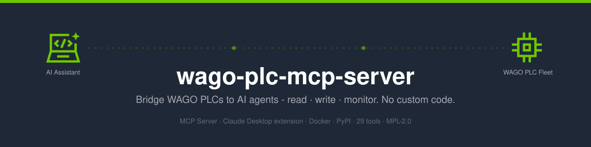
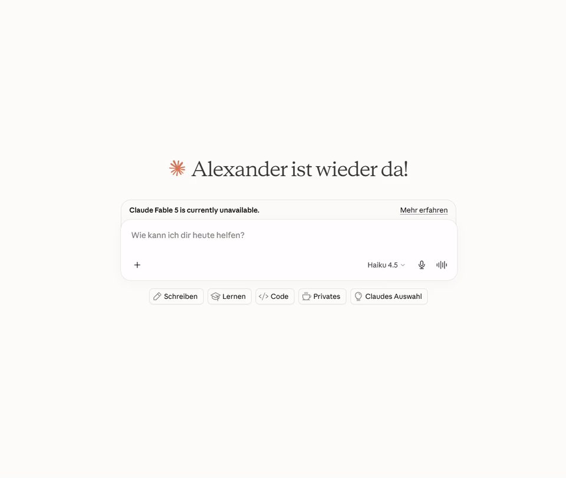
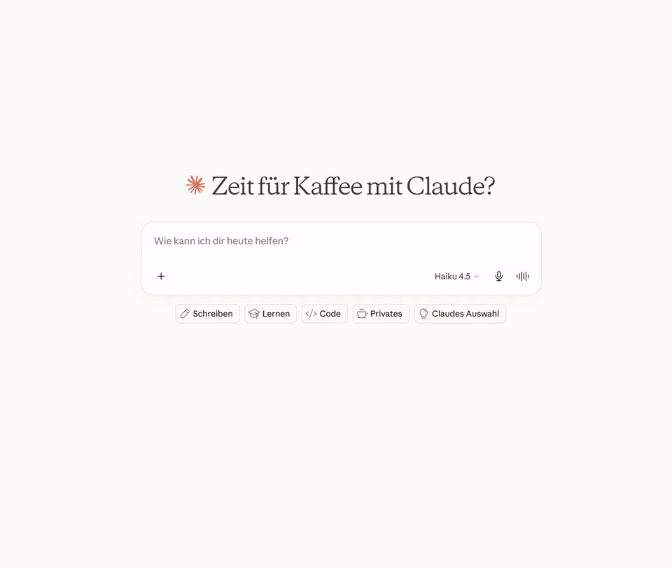
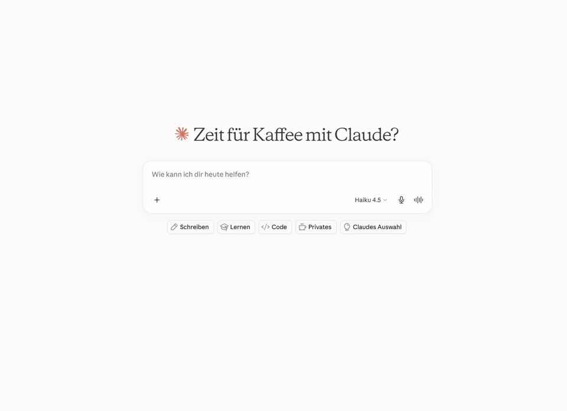
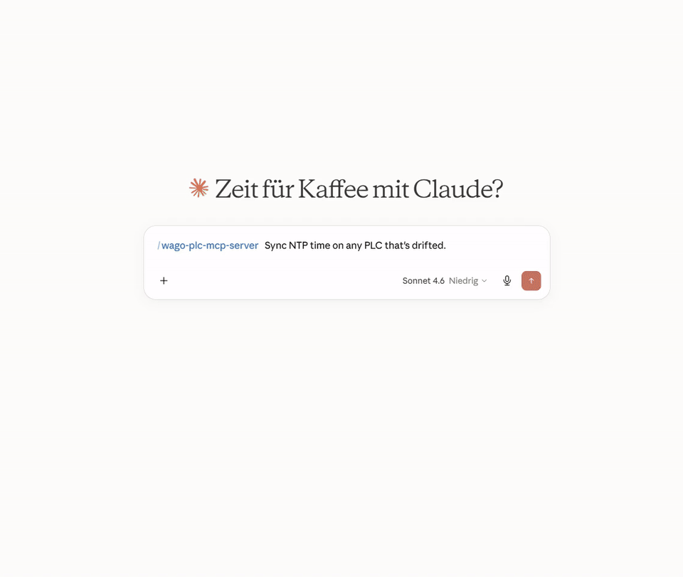
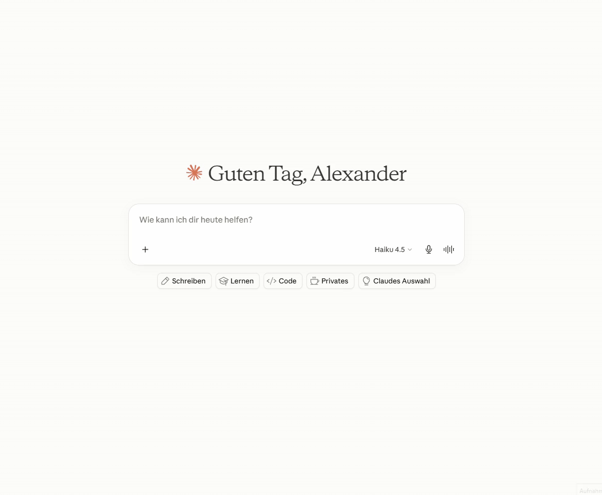
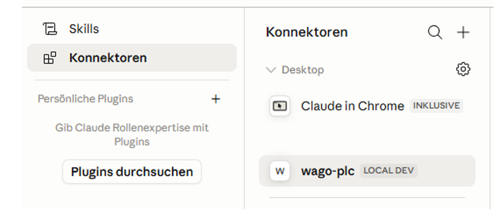
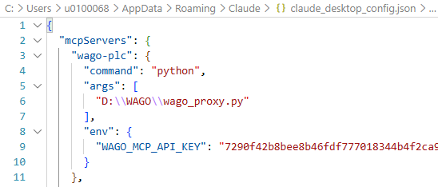
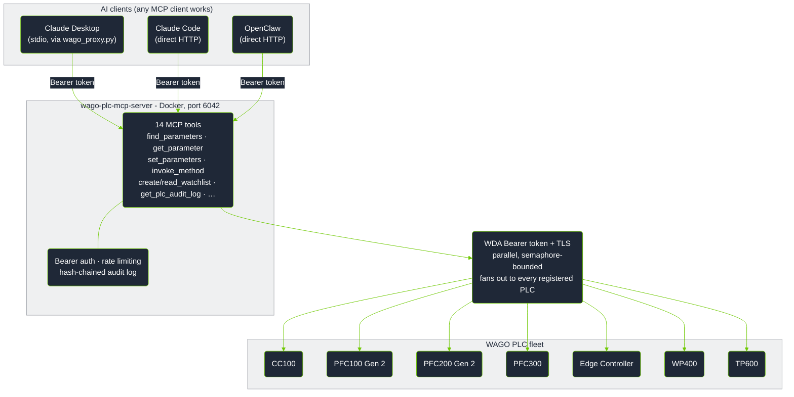

[](https://hub.docker.com/r/wagoalex/wago-plc-mcp-server)
[](LICENSE)
[](#tool-reference)
[](#supported-hardware)

# wago-plc-mcp-server

> Talk to your WAGO PLC fleet the way you'd talk to a colleague. Ask an AI assistant to read, configure, and monitor your controllers in plain English - no scripts, no parameter IDs to memorize.

---

## Choose your path

| I am a... | I want to... | Start here |
|-----------|-------------|------------|
| **Claude Desktop / Claude Code user** | Connect my AI assistant to WAGO PLCs and start asking questions | [Quick Start](#quick-start) → [What can I ask it?](#what-can-i-ask-it) |
| **Automation / OT engineer** | Understand what this does to my PLCs and whether it's safe | [What this does and doesn't do](#what-this-does-and-doesnt-do) |
| **Software / DevOps engineer** | Deploy this in production with GitOps, TLS, and audit logging | [Production deployment](#production-deployment) → [GitOps write-gate](#gitops-write-gate) |

---

## Demo

These are short screen recordings of the server driving real WAGO
controllers from Claude Desktop, start to finish - no edited-out steps.

### Overview - connecting Claude Desktop and a first interaction



<details>
<summary><strong>Use case 1 - fleet-wide health report across all 16 PLCs</strong></summary>

Asks the agent to reconcile a "health report" across the fleet - listing all
PLCs, bulk-fetching firmware versions, and probing device types to figure
out what's actually running where before trusting any conclusions.



</details>

<details>
<summary><strong>Use case 2 - Edge Controller: building a CPU/LED health watchlist</strong></summary>

Asks the agent to set up a watchlist monitoring CPU/service health and LED
diagnostic state on the Edge Controllers, then read it back - including the
agent pushing back to clarify ambiguous requirements before touching
anything, and discovering the actual parameter IDs via `find_parameters`
rather than guessing.


</details>

<details>
<summary><strong>Use case 2 - PFC300: building a CPU/LED health watchlist</strong></summary>

The same health-watchlist workflow as above, run against a PFC300 instead -
shows the same parameter-discovery process landing on different actual
parameter names for an equivalent capability.



</details>

<details>
<summary><strong>Use case 3 - detecting and fixing NTP drift fleet-wide</strong></summary>

Asks the agent to sync NTP time on any PLC that's drifted. The agent checks
NTP status across the entire fleet first, identifies which PLCs are
actually affected (stuck clocks, wrong timezone offsets), and only then
invokes the time-sync method on the specific units that need it.



</details>

<details>
<summary><strong>Use case 4 - which PLCs are reachable and what firmware are they running?</strong></summary>

Asks the agent to sweep the entire fleet, check reachability, and report
firmware versions - all in one shot. The agent calls `list_plcs`, then
`describe_plc` in parallel across every registered controller, and returns
a clean table of what's alive, what model it is, and which firmware build it
carries.


</details>

<details>
<summary><strong>Use case 5 - which devices still have the default NTP server configured?</strong></summary>

Asks the agent to audit NTP configuration across the fleet and flag any
controller still pointing at the factory-default time server. The kind of
compliance sweep that would otherwise require manual access to each device.



</details>

---

## Quick Start

### 1. Clone and configure

```bash
git clone https://github.com/WagoAlex/wago-plc-mcp-server.git
cd wago-plc-mcp-server
cp _env .env
```

Edit `.env`:

```env
WAGO_PLC_HOSTS=192.168.1.10,192.168.1.11,192.168.1.12
DEFAULT_PLC_USERNAME=admin
PORT=6042
WAGO_TIMEOUT_SECONDS=45
```

> [!TIP]
> For large fleets, use `WAGO_PLC_HOSTS_FILE=/app/data/fleet.txt` - one IP
> per line, `#` comments supported. Both can be set together; IPs are merged.

### 2. Set the PLC password

```bash
mkdir -p secrets
echo "your-plc-password" > secrets/plc_default_password.txt
chmod 600 secrets/plc_default_password.txt
```

### 3. Start

```bash
docker compose up -d
docker logs wmcp -f
```

On first boot the server generates an API key and announces its fingerprint
(the key itself is never written to container logs). Retrieve it with:

```bash
docker exec wmcp cat /app/data/mcp_api_key
```

> [!TIP]
> Once you're past initial testing, provision the key as a Docker Secret
> instead (see [API key management](#api-key-management)) - then retrieve it
> with `cat secrets/mcp_api_key.txt` directly on the host, no `docker exec`
> required.

```
════════════════════════════════════════════════════════════════════════
  NEW MCP API KEY GENERATED  (fingerprint: 7290f42b…)

  Stored in ./data/mcp_api_key - retrieve it with:
    docker exec wmcp cat /app/data/mcp_api_key

  .mcp.json:
    "headers": {"Authorization": "Bearer <key>"}

  Regenerate:  docker exec wmcp python src/mcp_keygen.py
════════════════════════════════════════════════════════════════════════

Registration: 3/3 ready
MCP server listening on http://0.0.0.0:6042/mcp (Streamable HTTP)
```

### 4. Connect your AI client

**Claude Code** (one command):
```bash
claude mcp add --transport http --header "Authorization: Bearer <key>" wago-plc http://localhost:6042/mcp
```

**Claude Desktop** - add to `%APPDATA%\Claude\claude_desktop_config.json`:
```json
{
  "mcpServers": {
    "wago-plc": {
      "type": "http",
      "url": "http://localhost:6042/mcp",
      "headers": { "Authorization": "Bearer <your-api-key>" }
    }
  }
}
```
Fully quit and relaunch Claude Desktop. You should see a hammer icon with 14 tools:



### 5. Install the WAGO skill (recommended)

The bundled skill teaches the assistant the WAGO parameter names, how to
operate safely, and how the tools actually behave. It's the difference
between a vague answer and one that lands on the right parameter first try.

```bash
mkdir -p ~/.claude/skills
cp -r wago-plc-skill ~/.claude/skills/
```

---

## What can I ask it?

You don't need to know any parameter IDs or anything about the WDA API. Just
ask for what you want; the assistant works out which tools to call and deals
with the REST plumbing for you.

### Fleet-wide checks

| What you type | What happens |
|---|---|
| "Which PLCs are running firmware older than build 31?" | Reads firmware version from every controller in parallel and lists the ones behind |
| "Are NTP and Docker running on all Edge Controllers?" | Reads service running-flags across the fleet, highlights stopped services |
| "Show the diagnostic LED states on all PLCs" | Reads SYS, RUN, and fieldbus LED text strings from every unit |
| "Is any controller showing a fault or error state?" | Cross-checks LED strings and error parameters fleet-wide |

### Single-controller diagnostics

| What you type | What happens |
|---|---|
| "What firmware version is running on 192.168.1.14?" | Reads the firmware version parameter |
| "List all network settings on Edge Controller .19" | Searches parameters by keyword, returns names + current values |
| "Is the CODESYS program loaded and running on PFC300 .22?" | Reads the CODESYS runtime state parameter |
| "What NTP server is configured on PLC .10?" | Reads NTP client configuration |

### Configuration changes and remote actions

| What you type | What happens |
|---|---|
| "Set the NTP server to 192.168.0.1 on all PLCs in building A" | Writes NTP address after your confirmation; every write is recorded in the audit log |
| "Trigger an NTP time sync on the three controllers that showed clock drift" | Invokes the NTP sync action only on affected units |
| "Enable SSH on controller .14 for remote maintenance access" | Finds the SSH enable parameter and writes it after confirmation |

### Ongoing monitoring

| What you type | What happens |
|---|---|
| "Set up a health monitor for the packaging line PLCs" | Creates a server-side watchlist combining LED states, service flags, and cloud status - one HTTP request per poll cycle |
| "Track the firmware update progress on all 12 PLCs" | Polls update status and progress across the fleet |

> [!NOTE]
> The assistant asks for confirmation before writing any value to a controller.

---

## What this does and doesn't do

### For automation and OT engineers

You know PLCs - TIA Portal, Studio 5000, EcoStruxure, ladder logic. Here's
the 60-second translation.

**What WDA/WDx is:** Every WAGO controller exposes a REST API called WDA
(WAGO Device Access) for **system and diagnostic management** - firmware
version, network config, service health, status LEDs, reboot and
firmware-update control. Think of it as the machine-readable equivalent of
TIA Portal's *Online & Diagnostics* view or Studio 5000's *Controller
Properties* - **not** a fieldbus, **not** OPC-UA, and **not** access to
your control program's I/O data.

**What MCP is:** A standard protocol that lets an AI assistant call a fixed
set of defined tools against a system, instead of you writing custom
integration code for every request. This server turns the WDA REST API into
14 tools an AI assistant can call directly.

| Term | Plain meaning | Closest thing you already know |
|---|---|---|
| WDA / WDx | WAGO's REST API for system/diagnostic management | TIA Portal *Online & Diagnostics*, Studio 5000 *Controller Properties* |
| MCP | Protocol letting an AI assistant call a fixed set of "tools" | A structured API contract invoked by an LLM instead of your own code |
| Parameter | A single named system value (firmware version, LED state, service flag) | A diagnostic/status tag - not a control-program I/O tag |
| Method | A remote action you can trigger (NTP sync, reboot, firmware update) | An RPC / "execute" command, similar to an online action in TIA/Studio 5000 |
| Watchlist | A server-side list of parameters the PLC keeps open for cheap repeated reads | Closest analog: a Watch Table (TIA) or Trend window (Studio 5000) - polled by an agent |

> [!IMPORTANT]
> **What this does NOT do:**
> - It is **WAGO-only** - no Siemens S7, Rockwell Logix, or Schneider Modicon.
> - It does **not** read or write your control program's I/O tags, real-time
>   process values, or PLC memory. Field I/O still goes through OPC-UA,
>   Modbus TCP, or WAGO I/O-Check.
> - It is **not** an HMI/SCADA replacement - no graphical front end, just
>   tool calls an AI assistant makes on your behalf.

### What values can actually be monitored

WDA exposes the **system management layer**, not the real-time process image.
What it *does* expose as live, poll-worthy values:

| Category | Example parameters | Typical use |
|---|---|---|
| **Service health** | `0-0-ntpclient-isrunning`, `0-0-docker-isrunning`, `0-0-ssh-isrunning`, `0-0-openvpn-isrunning` | Detect silently stopped services |
| **LED & fault state** | `0-0-ledstates-1-diagnosticinformation` (SYS), `0-0-ledstates-4-diagnosticinformation` (RUN) | Mirror physical status LEDs; surface diagnostic text without physical access |
| **Firmware update** | `0-0-firmwareupdate-status`, `0-0-firmwareupdate-progress` | Track OTA update progress across a fleet |
| **CODESYS runtime** | `0-0-codesys3-applications` | Confirm a PLC program is loaded and running |
| **Cloud connectivity** | `0-0-cloudconnections-1-status-connected`, `0-0-cloudconnections-1-status-filllevel` | Monitor MQTT broker reachability and queue depth |
| **System time** | `0-0-systemtime-now` | Verify clock synchronisation after NTP updates |

### Supported hardware

| Device | Article Numbers | Notes |
|--------|----------------|-------|
| CC100 | `751-9301` · `751-9401` · `751-9402` · `751-9403` | Slow ARM CPU - set `WAGO_TIMEOUT_SECONDS=45` |
| PFC100 Gen 2 | `750-8110` · `750-8111` · `750-8112` · `750-8112/025-000` | |
| PFC200 Gen 2 | `750-8210` · `750-8211` · `750-8212` · `750-8216` · `750-8217` | |
| PFC300 | `750-8302` | |
| Edge Controller | `752-8303/8000-0002` | Exposes CODESYS runtime state via `0-0-plcruntime-*` |
| WP400 | `762-34xx` | Web panel only - 189 WDA params, no CODESYS. HMI params: display brightness/orientation/screensaver, integrated browser startpage, touch cleaning mode |
| TP600 | `762-42xx` · `762-43xx` · `762-52xx` · `762-53xx` · `762-62xx` · `762-63xx` | Full PLC+HMI - 410 WDA params. CODESYS3, BACnet, cloud, serial, all WP400 HMI params plus front LED and acoustic feedback |

Requires firmware **build ≥ 28 (FW28)**. Tested up to **04.09.01 (FW31)**.

---

## How reads and writes work

Every operation an agent can perform falls into exactly one of three classes.
These are mutually exclusive and cover everything the server can do - there is
no fourth kind of action.

| Class | Tools | Changes the PLC? |
|---|---|---|
| **Read** | `list_plcs`, `describe_plc`, `find_parameters`, `get_parameter`, `get_parameters_bulk`, `find_methods`, `get_method`, `get_method_run`, `create_watchlist`, `read_watchlist`, `delete_watchlist`, `get_plc_audit_log` | No |
| **Write a parameter** | `set_parameters` | Yes - changes a stored config value |
| **Invoke a method** | `invoke_method` | Yes - triggers an action (NTP sync, reboot, firmware update, ...) |

### Standard behavior (default config: live mode, no read-only hosts)

- **Reads are always allowed.** They have no side effects and are never gated.
- **Parameter writes are allowed when the parameter is writeable.** The server
  pre-checks writeability from its cache and refuses values the firmware marks
  read-only for that device/firmware, before any HTTP call reaches the PLC.
- **Safe method calls are allowed.** Anything that is not on the dangerous list
  below runs directly.
- **Dangerous methods are denied.** Method IDs whose segments start with
  `reboot`, `restart`, `factory`, `firmware`, or `format` are refused unless you
  explicitly allowlist the exact ID.

### When a write or method call is allowed

The outcome is decided by three independent conditions. Read-only status takes
precedence over everything else; otherwise the server mode decides.

| Condition | Read | `set_parameters` | Safe `invoke_method` | Dangerous `invoke_method` |
|---|---|---|---|---|
| **Read-only PLC** (`WAGO_READONLY_HOSTS` or fleet `# readonly`) - any mode | Allowed | **Refused** | **Refused** | **Refused** |
| **Live mode** (`GITOPS_MODE=0`, default) | Allowed | Allowed if writeable | Allowed | **Denied** unless ID in `WAGO_ALLOW_METHODS` |
| **GitOps mode** (`GITOPS_MODE=1`) | Allowed | Returns a PR YAML fragment (no direct write) | Returns a PR YAML fragment | Returns a PR YAML flagged `requires_human: CRITICAL`; `apply.py` refuses to run it until a human sets `approved_by` |

Read it top-down: if the PLC is read-only, stop there - nothing is written. If
not, the active mode determines whether a write happens directly (live) or
becomes a reviewed pull request (GitOps).

Every write and every method call - allowed, refused, or denied - is recorded
in the tamper-evident [audit log](#audit-log). For the rationale behind the
dangerous-method and read-only gates, see
[Safety gates](#safety-gates---guarding-against-a-rogue-agent).

---

## Production deployment

### Deployment options

| Path | Best for | Requires |
|---|---|---|
| [Docker](#docker-recommended) | Plant server, shared multi-user fleet | Docker host on the OT network |
| [Windows .exe](#windows-exe) | OT engineer laptop, air-gapped Windows | Nothing - zero dependencies |
| [uvx / PyPI](#uvx--pypi) | Developer machine, any OS | `uv` installed |
| [IDE](#ide-cursor-vs-code) | Cursor, VS Code + Copilot | `uv` installed |
| [HTTP remote](#http-remote-chatgpt-api-n8n-openai) | ChatGPT, OpenAI API, n8n | Running server reachable over network |

Config file examples for every path: [`deploy/configs/`](deploy/configs/)

---

### Docker (recommended)

One server, many clients. PLCs register once at startup and stay connected.

```bash
cp _env .env          # edit PLC IPs, password, API key
docker compose up -d
```

Connect any client to `http://<host>:6042/mcp` with `Authorization: Bearer <key>`.

**Large fleet - host file:**

```
# data/fleet.txt
# Production floor A
192.168.1.10
192.168.1.11

# Production floor B
192.168.2.10
# 192.168.2.11   decommissioned
```

```env
WAGO_PLC_HOSTS_FILE=/app/data/fleet.txt
```

Fleet changes require editing the file and restarting the container. The
audit log persists across restarts on the `./data` volume.

---

### Windows .exe

Self-contained bundle - no Python, no package manager.

```bat
deploy\windows\build.bat        # build once on any Windows machine with Python 3.11+
deploy\windows\setup.bat        # configure .env and get the Claude Desktop JSON snippet
```

**`%APPDATA%\Claude\claude_desktop_config.json`:**

```json
{
  "mcpServers": {
    "wago-plc": {
      "command": "C:\\wago-mcp\\wago-proxy.exe",
      "env": {
        "WAGO_MCP_URL": "http://localhost:6042/mcp",
        "WAGO_MCP_API_KEY": "your-api-key"
      }
    }
  }
}
```



---

### uvx / PyPI

Runs the full server locally in stdio mode - no Docker, no proxy, no
persistent process. Starts fresh each Claude session (PLCs re-register on
connect, adds a few seconds).

**Requires:** [`uv`](https://docs.astral.sh/uv/getting-started/installation/)

**`%APPDATA%\Claude\claude_desktop_config.json`:**

```json
{
  "mcpServers": {
    "wago-plc": {
      "command": "uvx",
      "args": ["wago-plc-mcp-server"],
      "env": {
        "TRANSPORT": "stdio",
        "WAGO_PLC_HOSTS": "192.168.1.10,192.168.1.11",
        "DEFAULT_PLC_USERNAME": "admin",
        "DEFAULT_PLC_PASSWORD": "wago",
        "WAGO_TIMEOUT_SECONDS": "45",
        "LOG_LEVEL": "WARNING"
      }
    }
  }
}
```

Prefer Docker for fleets > 20 PLCs to avoid per-session re-registration.

---

### IDE (Cursor, VS Code)

**Cursor** - `.cursor/mcp.json` in the project root:

```json
{
  "servers": {
    "wago-plc": {
      "command": "uvx",
      "args": ["wago-plc-mcp-server"],
      "env": {
        "TRANSPORT": "stdio",
        "WAGO_PLC_HOSTS": "192.168.1.10",
        "DEFAULT_PLC_USERNAME": "admin",
        "DEFAULT_PLC_PASSWORD": "wago"
      }
    }
  }
}
```

**VS Code + Copilot** - `.vscode/mcp.json`, same structure.

---

### HTTP remote (ChatGPT API, n8n, OpenAI)

Any client that supports MCP over HTTP connects to `http://<host>:6042/mcp`
with `Authorization: Bearer <key>`. For legacy SSE clients set
`TRANSPORT=sse` in `.env` and point at `/sse`.

**OpenAI Responses API:**

```python
response = client.responses.create(
    model="gpt-4o",
    tools=[{
        "type": "mcp",
        "server_url": "http://plc-gateway.plant.internal:6042/mcp",
        "server_label": "wago-plc",
        "headers": {"Authorization": "Bearer <your-api-key>"}
    }],
    input="List all PLCs and their firmware versions."
)
```

---

### Skills - install the right one

Three skills ship with this repo - install the one that matches your use case:

| Skill | For | Install |
|---|---|---|
| [`wago-plc-skill/SKILL.md`](wago-plc-skill/SKILL.md) | **Claude Desktop / Claude Code end users** - plain-English interaction, safety guidance, troubleshooting | `cp -r wago-plc-skill ~/.claude/skills/` |
| [`wago-plc-agent-skill/SKILL.md`](wago-plc-agent-skill/SKILL.md) | **Autonomous agents / pipelines** - tool I/O contracts, error shapes, retry rules, watchlist lifecycle | `cp -r wago-plc-agent-skill ~/.claude/skills/` |
| [`wago-quickref/SKILL.md`](wago-quickref/SKILL.md) | **Contributors to this repo** - raw WDA HTTP behaviour, pagination encoding, payload shapes | `cp -r wago-quickref ~/.claude/skills/wago-plc-mcp-server` |

---

## GitOps write-gate

For production environments where every PLC configuration change needs a
human-reviewed audit trail before it reaches hardware - an ArgoCD-style
pattern applied to PLCs.

### How it works

```
Agent proposes a config change
         │
         ▼ (GITOPS_MODE=1)
set_parameters / invoke_method returns YAML instead of writing
         │
         ▼
Agent commits YAML to wago-plc-config repo and opens a PR
         │
         ▼
Engineer reviews and approves the PR
         │
         ▼
CI runs: python scripts/apply.py plcs/192.168.1.10.yaml --execute
         │
         ▼
Live PLC updated - ops files self-delete on success
```

The CI step is a GitHub Actions workflow living in the config repo, not here -
it decides dry-run vs. execute purely from the triggering event, never from a
flag you set: a pull request always dry-runs (prints drift, touches nothing),
and only a push to `main` (i.e. a merge) executes. It runs on a **self-hosted
runner** because GitHub-hosted runners have no route to the PLC subnet, and it
borrows `scripts/apply.py` from this repo via sparse-checkout on every run - a
fix here is picked up there without a version bump. Full mechanics (trigger
table, checkout steps, secrets, why `contents: write` is needed for the
ops-file-cleanup commit): [wago-plc-config README - How the GitHub Actions
workflow works](https://github.com/WagoAlex/wago-plc-config#how-the-github-actions-workflow-works).

### Enable

```env
GITOPS_MODE=1   # intercept writes; return YAML fragments for PR
GITOPS_MODE=0   # default: write directly (still fully audit-logged)

# Only needed if your config repo isn't named/owned wago-plc-config -
# every returned YAML fragment's next_step points the agent at this repo.
WAGO_GITOPS_REPO=wago-plc-config
```

> [!IMPORTANT]
> Without `WAGO_GITOPS_REPO` set correctly, the agent has no other way to know
> where to commit the YAML fragment - the repo name comes from this variable,
> not from any auto-discovery. If you fork or rename the config repo, set this
> or the returned `next_step` instructions will point at the wrong (or a
> nonexistent) repo.

### Config YAML - two file types

**`plcs/<ip>.yaml` - desired steady state**

```yaml
plc_ip: 192.168.1.10
managed_parameters:
  0-0-ntpclient-enabled: true
  0-0-ntpclient-configuredtimeservers:
    - 192.168.1.1
  0-0-snmp-enable: true
  0-0-snmp-communities-1-name: ops-team
  0-0-snmp-location: Building-A-Panel-3
```

`apply.py` reads the live PLC, diffs it against this file, and patches only
parameters that have drifted. Idempotent - safe to run in CI on every merge.

**`ops/<id>.yaml` - one-shot action (self-deletes on success)**

```yaml
id: b7d3e1f9
proposed_at: 2026-06-21T10:00:00+00:00
proposed_by: agent-claude-code
plc_ip: 192.168.1.10
action: invoke_method
method_id: 0-0-ntpclient-updatetime
arguments: {}
```

### Apply manually

```bash
# Show what would change - no writes
python scripts/apply.py plcs/192.168.1.10.yaml

# Apply drift to live PLC
python scripts/apply.py plcs/192.168.1.10.yaml --execute

# Invoke a one-shot method
python scripts/apply.py ops/b7d3e1f9.yaml --execute
```

### Supported subsystems (parameter IDs)

| Subsystem | Key parameters | Helper |
|-----------|---------------|--------|
| Cloud / MQTT | `0-0-cloudconnections-1-*` | `gitops.cloud_params()` |
| NTP | `0-0-ntpclient-enabled/configuredtimeservers/updateinterval` | `gitops.ntp_params()` |
| SNMP | `0-0-snmp-enable/communities-1-name/location/contact` | `gitops.snmp_params()` |
| Serial port | `0-0-serialinterfaces-1-assignedmode/assignedowner` | `gitops.serial_params()` |
| OpenVPN | `0-0-openvpn-enabled/configurationdescription` | `gitops.openvpn_params()` |
| HMI browser | `0-0-integratedwebbrowser-startpage/startpagefavorite` | `gitops.browser_params()` |
| FTP / FTPS | `0-0-ftpd-enabled/ftps` | direct |
| SSH | `0-0-ssh-enabled` | direct |
| Docker | `0-0-docker-enabled` | direct |
| CODESYS 3 webserver | `0-0-codesys3-webserver-enabled` | direct |

Full parameter ID reference with YAML examples for every subsystem:
[`docs/gitops/README.md`](docs/gitops/README.md)

The config repo that receives these YAML fragments and runs `apply.py` via CI:
[github.com/WagoAlex/wago-plc-config](https://github.com/WagoAlex/wago-plc-config)

### Safety gates - guarding against a rogue agent

The risk with giving an AI agent write access to industrial controllers is not
just "it might delete something" - it's that an agent can go off-script
(hallucination, prompt injection, a bug) and take a high-consequence action you
never wanted. On a production line, a config change with side effects or a
badly-timed reboot can mean equipment damage or worse. These gates are enforced
in code and **cannot be overridden by the agent**:

| Gate | What it does | Configure |
|------|--------------|-----------|
| **Read-only PLCs** | Listed controllers reject *all* writes and method calls, in every mode | `WAGO_READONLY_HOSTS=ip,ip` or a `# readonly` tag per line in the fleet file |
| **Dangerous-method denylist** | Reboot / restart / factory-reset / firmware / format are denied in live mode unless explicitly allowlisted | `WAGO_ALLOW_METHODS=<exact-method-id>` to re-enable one |
| **Human approval for dangerous ops** | In GitOps mode these become a PR flagged `requires_human: CRITICAL`; `apply.py` refuses to run until a human sets `approved_by` | set `approved_by` during PR review, or inject `WAGO_APPROVED_BY` from CI |

The intended path for any high-consequence action is therefore a **human-reviewed
PR plus an audit-log entry** - not an autonomous tool call. A denial is the
system working as designed. Full details and a dry-run walkthrough:
[`docs/gitops/README.md` → Safety model](docs/gitops/README.md#safety-model--three-independent-gates)

Step-by-step guide for reviewers (GitHub UI and CLI):
[github.com/WagoAlex/wago-plc-config](https://github.com/WagoAlex/wago-plc-config)

---

## Security

### API key management

The server resolves the MCP API key in priority order:

1. **Docker Secret** `/run/secrets/mcp_api_key` - recommended for production
2. **Env var** `MCP_API_KEY`
3. **Persisted file** `./data/mcp_api_key` - auto-generated on first boot, survives container recreations
4. **Auto-generate** - new key if none of the above exist

> [!TIP]
> Retrieving the key differs by source. With a Docker Secret (path 1), read
> `secrets/mcp_api_key.txt` directly on the host - no `docker exec` needed, so
> the key never crosses the container boundary or touches any container-side
> log path:
> ```bash
> cat secrets/mcp_api_key.txt
> ```
> With the auto-generated key (path 3/4), it only exists inside the
> container's `/app/data` volume:
> ```bash
> docker exec wmcp cat /app/data/mcp_api_key
> ```
> Prefer the Docker Secret path once you've moved past initial testing - it's
> both more auditable (key lifecycle lives in a file you control, not a
> volume the server writes to) and keeps the key out of any container-exec
> trail entirely.

```bash
# Regenerate (only affects the auto-generated/persisted key - has no effect
# if a Docker Secret or MCP_API_KEY env var is set, since those outrank it)
docker exec wmcp python src/mcp_keygen.py
docker restart wmcp
```

### TLS configuration

Both TLS legs are opt-in. The server starts without TLS and logs a startup
warning for each disabled leg.

**WDA connections (server → PLC) - three options:**

```bash
# Option A: Per-PLC cert pinning (recommended for self-signed certs)
openssl s_client -connect 192.168.1.10:443 </dev/null 2>/dev/null \
  | openssl x509 > secrets/plc_cert_192_168_1_10
# Declare the secret in docker-compose.yml and restart

# Option B: Private CA bundle
WAGO_TLS_CA=/run/secrets/wago_ca.pem

# Option C: System trust store (only if PLC certs are CA-signed)
WAGO_TLS_CA=true
```

**MCP endpoint (client → server):**

```bash
openssl req -x509 -newkey rsa:4096 \
  -keyout secrets/mcp_tls_key.pem \
  -out secrets/mcp_tls_cert.pem \
  -days 365 -nodes -subj "/CN=wago-mcp"
```

```env
MCP_TLS_CERT=/run/secrets/mcp_tls_cert
MCP_TLS_KEY=/run/secrets/mcp_tls_key
```

### Audit log

Every `set_parameters` and `invoke_method` call is appended to a
tamper-evident hash-chained JSON-lines log:

```
Entry 1  {"ts":"…","action":"set_parameters",…,"prev":"0000…0000"}  ← genesis
Entry 2  {"ts":"…","action":"invoke_method",…,"prev":"a3f1…c2d8"}
Entry 3  {"ts":"…","action":"set_parameters",…,"prev":"7b2e…91fa"}
```

Each entry includes timestamp, PLC IP, parameter IDs + values, and
`key-<first 8 chars of API key>` for per-engineer traceability.

```bash
# Tail live log
docker exec wmcp tail -f /app/audit.log

# Verify chain integrity
docker exec wmcp python src/audit_verify.py
# → [PASS] Chain intact - 42 entries verified (/app/audit.log)
```

### Security feature summary

| Feature | Status |
|---------|--------|
| Bearer auth on `/mcp` | ✅ Auto-generated key; Docker Secret + env override; `/health` exempt |
| Rate limiting | ✅ 60 req/60 s per source IP; `429` with `Retry-After` |
| Auth failure alerts | ✅ WARNING per failure; ERROR at 10 consecutive from same IP |
| WDA Bearer token auth | ✅ Credentials sent once; cached token refreshed on 401 |
| Hash-chained audit log | ✅ Tamper-evident JSON-lines on `./data` volume |
| Default password warning | ✅ Startup WARNING if factory default password detected |
| TLS - WDA connections | ⚙️ Off by default; enable with `WAGO_TLS_CA` or per-PLC Docker Secret |
| TLS - MCP endpoint | ⚙️ Off by default; enable with `MCP_TLS_CERT` + `MCP_TLS_KEY` |
| CycloneDX SBOM | ✅ Published alongside every release image |
| Docker Secrets | ✅ PLC passwords, MCP key, TLS certs all mountable as secrets |
| CVE scanning | ✅ Weekly grype scan on SBOM; HIGH/CRITICAL fails CI |

For the vulnerability disclosure policy, patch SLA, and support lifetime see [SECURITY.md](SECURITY.md).

---

## Tool reference

### Discovery

| Tool | Description |
|------|-------------|
| `list_plcs` | List all registered PLC IPs |
| `describe_plc(plc_ip)` | Capability counts + feature names + `device_class`, `expected_parameter_count`, `parameter_count_ok` |
| `get_plc_audit_log(plc_ip, action, limit)` | Read recent tamper-evident audit log entries; filter by PLC and/or action, newest first (max 500) |

### Parameters

| Tool | Description |
|------|-------------|
| `find_parameters(plc_ip, query, writeable_only, user_settings_only, limit)` | Search by keyword (up to 100 results) |
| `get_parameter(plc_ip, parameter_id)` | Read one value, enum labels resolved |
| `get_parameters_bulk(requests)` | Read one param from N PLCs in parallel |
| `set_parameters(plc_ip, parameters)` | Write one or more parameters (bulk PATCH) |

### Methods

| Tool | Description |
|------|-------------|
| `find_methods(plc_ip, query, limit)` | Search by keyword |
| `get_method(plc_ip, method_id)` | Fetch inArgs/outArgs schema |
| `invoke_method(plc_ip, method_id, arguments, wait)` | Execute sync or async |
| `get_method_run(plc_ip, method_id, run_id)` | Poll async run status |

### Watchlists

| Tool | Description |
|------|-------------|
| `create_watchlist(plc_ip, parameter_ids, timeout_seconds)` | Register a server-side monitoring list on the PLC |
| `read_watchlist(plc_ip, watchlist_id)` | Return current values for all watched parameters (one HTTP request) |
| `delete_watchlist(plc_ip, watchlist_id)` | Release the watchlist immediately |

**Why watchlists exist:** Every `get_parameter` call opens a new HTTPS connection. For repeated polling of a fixed set across a fleet, the overhead compounds: 10 parameters × 15 PLCs every 30 seconds = 150 HTTPS round-trips per cycle. Watchlists solve this - one `read_watchlist` returns all current values in a single request.

### Example workflows

**Read firmware version from all PLCs in one call:**
```
get_parameters_bulk([
  {"plc_ip": "192.168.1.10", "parameter_id": "0-0-version-firmwareversion"},
  {"plc_ip": "192.168.1.11", "parameter_id": "0-0-version-firmwareversion"}
])
```

**Sync NTP time on a PLC:**
```
find_methods("192.168.1.10", "ntp")
→ ["0-0-ntpclient-updatetime"]

invoke_method("192.168.1.10", "0-0-ntpclient-updatetime", wait=True)
→ {"status": "done", "run_id": "1", "out_args": {}}
```

**Poll operational health with a watchlist:**
```
create_watchlist("192.168.1.10", [
  "0-0-ledstates-1-diagnosticinformation",
  "0-0-ledstates-4-diagnosticinformation",
  "0-0-ntpclient-isrunning",
  "0-0-docker-isrunning",
  "0-0-cloudconnections-1-status-connected"
], timeout_seconds=300)

read_watchlist("192.168.1.10", "1")   # call every 30 s
delete_watchlist("192.168.1.10", "1") # explicit cleanup when done
```

---

## Configuration reference

| Variable | Default | Description |
|----------|---------|-------------|
| `WAGO_PLC_HOSTS` | - | Comma-separated PLC IPs |
| `WAGO_PLC_HOSTS_FILE` | - | Path to host file (one IP per line) |
| `DEFAULT_PLC_USERNAME` | `admin` | Shared username |
| `DEFAULT_PLC_PASSWORD` | `wago` | Shared password (use Docker Secret instead) |
| `PLC_PASSWORDS_<ip_underscores>` | - | Per-PLC password override |
| `MCP_API_KEY` | - | Bearer token for `/mcp`; auto-generated if absent |
| `GITOPS_MODE` | `0` | `1` = intercept writes, return YAML fragments |
| `WAGO_GITOPS_REPO` | `wago-plc-config` | Config repo name/path shown in the returned YAML's `next_step` - point this at a fork or a differently-named repo |
| `WAGO_READONLY_HOSTS` | - | Comma-separated PLC IPs that refuse `set_parameters`/`invoke_method` in every mode |
| `WAGO_ALLOW_METHODS` | - | Comma-separated exact method IDs to re-allow from the dangerous-method denylist in live mode |
| `WAGO_TLS_CA` | - | WDA TLS: `false` (off), `true` (system CA), or path |
| `MCP_TLS_CERT` | - | Path to TLS cert for MCP endpoint |
| `MCP_TLS_KEY` | - | Path to TLS private key for MCP endpoint |
| `MCP_TLS_KEY_PASSWORD` | - | Password for encrypted TLS private key (optional) |
| `AUDIT_LOG_FILE` | `/app/audit.log` | Audit log path inside container |
| `SYSLOG_HOST` | - | Syslog/SIEM receiver hostname; enables audit forwarding |
| `SYSLOG_PORT` | `514` | Syslog receiver port |
| `SYSLOG_TCP` | `false` | `true` = TCP (reliable), `false` = UDP |
| `TRANSPORT` | `streamable-http` | `streamable-http` or `sse` |
| `HOST` | `0.0.0.0` | Bind address |
| `PORT` | `6042` | Listen port |
| `WAGO_TIMEOUT_SECONDS` | `45` | Per-PLC HTTP timeout (CC100 needs 45+) |
| `WAGO_PAGE_LIMIT` | `500` | WDA pagination page size |
| `WAGO_MAX_CONCURRENT_REGISTRATIONS` | `5` | Parallel PLC init limit |
| `WAGO_MAX_CONCURRENT_READS` | `10` | Parallel PLC request limit inside `get_parameters_bulk` |
| `LOG_LEVEL` | `INFO` | `DEBUG` / `INFO` / `WARNING` / `ERROR` |
| `LOG_FILE` | `/app/mcp_server.log` | Debug log path inside container |

---

## Frequently asked questions

### Can the AI modify my control program or process I/O values?

**No.** The WDA REST API has no access to the CODESYS runtime, PLC variables,
fieldbus I/O, or anything in your control program. Field I/O still goes
through OPC-UA, Modbus TCP, or WAGO I/O-Check.

### What if the AI writes a wrong value?

Every write is recorded in the tamper-evident audit log with timestamp,
parameter ID, value written, and which API key made the change. For most WDA
parameters a wrong value is correctable by writing the correct value again.
For disruptive actions like firmware update or reboot, the assistant asks for
explicit confirmation before executing.

### Does the server need internet access after initial setup?

No. All traffic is local: AI client → MCP server (port 6042) → PLCs (port
443 HTTPS). No cloud calls, no telemetry. Suitable for air-gapped OT networks
once the Docker image has been transferred to the host.

### Our PLCs have different passwords. How do we configure that?

```env
DEFAULT_PLC_PASSWORD=wago             # applied to all PLCs unless overridden
PLC_PASSWORDS_192_168_1_11=secret     # override for this unit (IP with underscores)
```

### What firewall rules does IT need to open?

| Direction | Source | Destination | Port | Protocol |
|---|---|---|---|---|
| Inbound | Engineer workstations | MCP server host | 6042 | TCP |
| Outbound | MCP server host | WAGO PLC IPs | 443 | TCP (HTTPS) |

### Can multiple engineers share one server?

Yes. Deploy one container on a host reachable from the OT network. Each
engineer connects their own client to `http://<server>:6042/mcp`. Use a
shared API key, or provision individual keys per engineer for per-person
traceability in the audit log.

### Which firmware version is required?

Firmware build **≥ 28** (`04.xx.xx(28)` or later). Check the build number in
the controller's web interface under *Device Information*, or ask the
assistant: *"What firmware version is PLC 192.168.x.x running?"*

---

## Fetching raw parameter data (curl)

For bulk exports, debugging, or building contract-test cassettes, bypass the
MCP layer and query WDA directly. WDA hard-caps at 255 entries per page -
most device classes need two pages. Always include
`parameter-errors-as-data-attributes=true`.

```bash
IP=192.168.1.10
OUT=wda-parameters-${IP}.json

{
  curl -sk -u "admin:wago" -H "Accept: application/vnd.api+json" --max-time 90 \
    -G --data-urlencode "parameter-errors-as-data-attributes=true" \
       --data-urlencode "page[limit]=255" \
       --data-urlencode "page[offset]=0" \
    "https://${IP}/wda/parameters"
  curl -sk -u "admin:wago" -H "Accept: application/vnd.api+json" --max-time 90 \
    -G --data-urlencode "parameter-errors-as-data-attributes=true" \
       --data-urlencode "page[limit]=255" \
       --data-urlencode "page[offset]=255" \
    "https://${IP}/wda/parameters"
} | jq -s '{data: (map(.data) | add)}' > "$OUT"

echo "Saved $(jq '.data | length' "$OUT") parameters to $OUT"
```

`page[limit]` and `page[offset]` **must** be passed via `--data-urlencode` - embedding literal brackets in the URL string is silently ignored and causes an infinite page-0 loop.

---

## Architecture



Demoed end to end with **16 PLCs** of mixed device class on a single rack.
The parallel fan-out model has no architectural ceiling below **100+**.

---

## Requirements

- Docker 24+ with Compose v2
- WAGO PLC with WDx/WDA REST API enabled (firmware build ≥ 28)
- Network route from Docker host to PLC subnets

For Claude Desktop proxy: Python 3.11+ and `fastmcp` on the client machine.

---

## Security & CRA compliance

This project targets compliance with the EU Cyber Resilience Act (Regulation 2024/2847).

| Document | Purpose |
|----------|---------|
| [SECURITY.md](SECURITY.md) | Vulnerability reporting, patch SLA, support lifetime |
| [docs/threat-model.md](docs/threat-model.md) | STRIDE risk assessment |
| [docs/cra-compliance-matrix.md](docs/cra-compliance-matrix.md) | Annex I requirements → evidence mapping |
| [docs/eu-declaration-of-conformity.md](docs/eu-declaration-of-conformity.md) | CRA Article 28 self-declaration |
| [docs/technical-file.md](docs/technical-file.md) | CRA Article 31 technical file index |

---

## Releases

Pre-built images on [Docker Hub](https://hub.docker.com/r/wagoalex/wago-plc-mcp-server). A CycloneDX SBOM is published alongside every release. `docker compose up -d` pulls the latest automatically.

---

## License

[Mozilla Public License 2.0](LICENSE)
