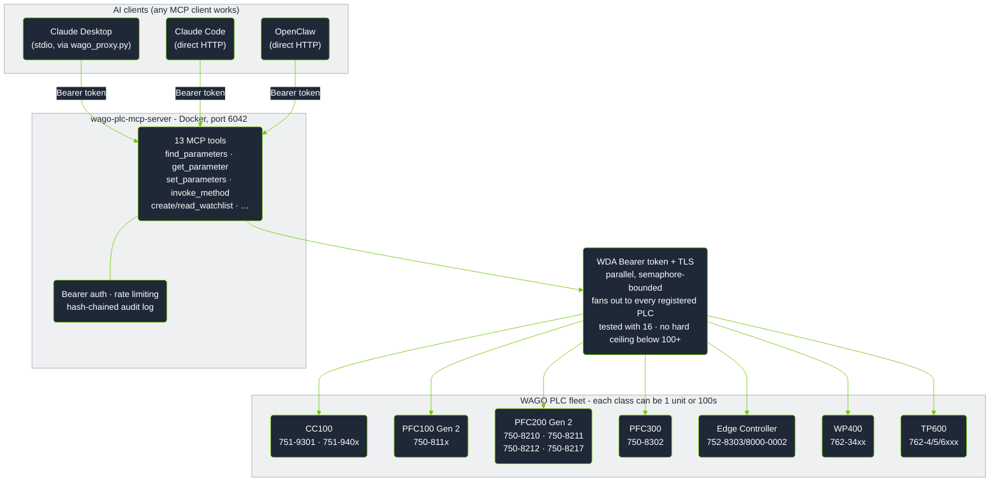

[](https://hub.docker.com/r/wagoalex/wago-plc-mcp-server)
[](LICENSE)
[](#tool-reference)
[](#demo)

# wago-plc-mcp-server

> MCP server that connects WAGO PLCs to LLM agents via the WDx/WDA REST API.

Ask an AI assistant to read sensor values, change configuration, trigger firmware updates, or monitor entire PLC fleets - with no custom code.

---

**Quick navigation:** [What it does](#new-to-wago-mcp-or-wda-start-here) · [What to ask it](#what-can-i-ask-it) · [Connecting Clients](#connecting-clients) · [Quick Start](#quick-start) · [FAQ](#frequently-asked-questions) · [Deployment Paths](#deployment-paths) · [Tool Reference](#tool-reference) · [Configuration](#configuration-reference)

---

## New to WAGO, MCP, or WDA? Start here

You know PLCs - TIA Portal, Studio 5000, EcoStruxure, ladder/structured
text, fieldbuses. You've never touched a WAGO controller or heard of "MCP"
or "WDA." Here's the 60-second translation.

**What WAGO is:** A PLC vendor, same category as Siemens/Rockwell/Schneider.
Their controllers (PFC200, PFC300, Edge Controller) run a CODESYS-based
runtime - your IEC 61131-3 program logic looks the same as on any other
CODESYS-compatible PLC.

**What WDA/WDx is:** Every WAGO controller exposes a REST API called WDA
(WAGO Device Access) for **system and diagnostic management** - firmware
version, network config, service health, status LEDs, reboot/firmware-update
control. Think of it as the machine-readable equivalent of TIA Portal's
*Online & Diagnostics* view or Studio 5000's *Controller Properties* -
**not** a fieldbus, **not** OPC-UA, and **not** access to your control
program's I/O data.

**What MCP is:** Model Context Protocol - a standard way for an AI
assistant (Claude, etc.) to call a fixed set of defined "tools" against a
system, instead of you writing custom integration code for every request.
This repo implements an MCP server that turns the WDA REST API into 13
tools an AI assistant can call directly: read a parameter, write a
parameter, run a method, poll a watchlist of values, etc.

**What this project actually does:** Bridges WDA → MCP, so you can ask an
AI assistant things like *"what firmware version is PLC .10 running?"* or
*"is the NTP service healthy on all 16 PLCs?"* in plain English, and it
calls the right WDA endpoint(s) for you - no REST client, no custom script.

> [!IMPORTANT]
> **What this does NOT do:**
> - It is **WAGO-only** - there's no Siemens S7, Rockwell Logix, or Schneider
>   Modicon driver here.
> - It does **not** read or write your control program's I/O tags, real-time
>   process values, or PLC memory. Field I/O still goes through OPC-UA,
>   Modbus TCP, or WAGO I/O-Check - see
>   [What values can be monitored](#what-values-can-be-monitored) for exactly
>   what WDA *does* expose.
> - It is **not** an HMI/SCADA replacement - there's no graphical front end,
>   just tool calls an AI assistant makes on your behalf.

| Term | Plain meaning | Closest thing you already know |
|---|---|---|
| WDA / WDx | WAGO's REST API for system/diagnostic management | TIA Portal *Online & Diagnostics*, Studio 5000 *Controller Properties* |
| MCP | Protocol letting an AI assistant call a fixed set of "tools" | A structured API contract - but invoked by an LLM instead of your own code |
| Parameter | A single named value on the PLC (firmware version, an LED state, a service flag) | A diagnostic/status tag - not a control-program I/O tag |
| Method | A remote action you can trigger (e.g. sync NTP time, trigger reboot) | An RPC / "execute" command, similar to an online action in TIA/Studio 5000 |
| Watchlist | A server-side list of parameters the PLC keeps "open" so repeated reads are cheap | Closest analog: a Watch Table (TIA) or Trend window (Studio 5000) - but polled by the AI agent, not displayed live in a GUI grid |

New here and just want to see it work? Jump to the [Demo](#demo) section -
short recordings of the exact kind of conversation described above, running
against real hardware.

---

## Architecture & Workflow

No one - neither the human asking the question nor the AI assistant
answering it - needs to know WAGO parameter IDs or WDA's schema *upfront*.
`describe_plc`, `find_parameters`, and `find_methods` let the agent discover
what's actually available on each PLC live, the same way a new hire would
explore an unfamiliar controller's diagnostics for the first time. That's
the core problem this project solves: turning "I have no idea what this
fleet of PLCs exposes" into a plain-English answer, without writing a
custom integration for every question in advance.



**What actually happens when you ask a fleet-wide question**, e.g.
*"which PLCs are running outdated firmware?"*:

1. **You ask** the AI client (Claude Desktop, Claude Code, OpenClaw, or any
   other MCP-compatible client) in plain English - no parameter IDs, no
   WDA knowledge required.
2. **The assistant picks the right tool(s)** - here, `list_plcs` to enumerate
   the fleet, then `get_parameters_bulk` to read
   `0-0-version-firmwareversion` from every PLC in one call.
3. **The server fans the request out** to each registered PLC in parallel
   (semaphore-bounded, `WAGO_MAX_CONCURRENT_REGISTRATIONS`), opening a WDA
   session per PLC with its own Bearer token and TLS settings.
4. **Each PLC answers independently** - a slow or unreachable CC100 doesn't
   block the other 15 (or 100+) PLCs in the fleet from responding.
5. **Results are aggregated back into one answer** - the assistant
   reconciles per-PLC values into the single fleet-wide answer you actually
   asked for, e.g. *"3 of 16 PLCs are on FW28 or older: .14, .19, .22."*

The "fleet" in that walkthrough isn't one of each device class. It's
whatever you actually have on the floor: 50 PFC200s on a production line,
10 PFC300s in a packaging cell, 200 Edge Controllers across a multi-site
rollout, WP400 panels on machine fronts, TP600 HMIs on operator stations,
or any mix. The fan-out model treats every registered IP identically
regardless of device class, so the same single question scales from a
single test rack to a plant-wide fleet without any code change.

Demoed end to end with **16 PLCs** of mixed device class/firmware on a
single rack; the parallel fan-out model has no architectural ceiling that
caps it well below **100+**.

---

## Supported Hardware

| Device | Article Numbers | Notes |
|--------|----------------|-------|
| CC100 | `751-9301` · `751-9401` · `751-9402` · `751-9403` | Slow ARM CPU - set `WAGO_TIMEOUT_SECONDS=45` |
| PFC100 Gen 2 | `750-8110` (ECO) · `750-8111` · `750-8112` (RS-232/485) · `750-8112/025-000` (XTR) | |
| PFC200 Gen 2 | `750-8210` · `750-8211` (SFP) · `750-8212` (Serial) · `750-8216` (Telecontrol) · `750-8217` (4G) | |
| PFC300 | `750-8302` | |
| Edge Controller | `752-8303/8000-0002` | Exposes CODESYS runtime state via WDA (`0-0-plcruntime-*` parameters) |
| WP400 | `762-34xx` series | Web panel only — 189 WDA params, no CODESYS, no BACnet, no I/O bus. HMI-unique: display brightness/orientation/screensaver (`0-0-display-*`), integrated browser startpage + reconnect (`0-0-integratedwebbrowser-*`), touch cleaning mode |
| TP600 | `762-42xx` · `762-43xx` · `762-52xx` · `762-53xx` · `762-62xx` · `762-63xx` | Full PLC+HMI — 410 WDA params. Has CODESYS3 runtime (`0-0-codesys3-*`), BACnet, cloud connectivity, serial. Plus all WP400 display/browser params, front LED (`0-0-frontled-enabled`), acoustic feedback (`0-0-touchpanel-acousticfeedback-enabled`) |

Requires firmware **build ≥ 28 (FW28)** with WDx/WDA REST API enabled. Tested up to **04.09.01 (FW31)**.

---

## Features

- **13 MCP tools** - discover, read, write, invoke methods, monitor
- **Fleet-wide parallel reads** - query one parameter across all PLCs in a single tool call
- **Server-side watchlists** - efficient repeated polling without repeated handshakes
- **Enum resolution** - raw integer enum values translated to human-readable labels
- **Writeability pre-validation** - read-only parameters rejected before hitting the PLC
- **Fuzzy parameter search** - find parameters by keyword without knowing exact IDs (up to 255 results)
- **Dual transport** - Streamable HTTP (default) or SSE, switched via env var
- **Docker-first** - single container, host networking for routed PLC subnets

### Security

| Feature | Status | Details |
|---------|--------|---------|
| Bearer auth on `/mcp` | ✅ | Auto-generated key; Docker Secret + env override; `/health` exempt |
| Rate limiting | ✅ | 60 req / 60 s per source IP; `429` with `Retry-After` |
| Auth failure alerts | ✅ | WARNING per failure; ERROR alert at 10 consecutive failures from same IP |
| WDA Bearer token auth | ✅ | Credentials sent once; cached token refreshed reactively on 401 |
| Hash-chained audit log | ✅ | Every write is a tamper-evident JSON-lines entry with `prev` SHA-256 |
| Default password warning | ✅ | Startup WARNING if factory default password detected |
| TLS - WDA connections | ⚙️ | Off by default; enable with `WAGO_TLS_CA` or per-PLC Docker Secret |
| TLS - MCP endpoint | ⚙️ | Off by default; enable with `MCP_TLS_CERT` + `MCP_TLS_KEY` |
| CycloneDX SBOM | ✅ | Published alongside every release image |
| Docker Secrets | ✅ | PLC passwords, MCP key, TLS certs all mountable as secrets |
| CVE scanning | ✅ | Weekly grype scan on SBOM; HIGH/CRITICAL fails CI |
| Dependabot | ✅ | Weekly PRs for pip, Docker, and GitHub Actions dep updates |

For the vulnerability disclosure policy, patch SLA, and support lifetime see [SECURITY.md](SECURITY.md).

---

## Demo

Short screen recordings of the server driving real WAGO controllers from
Claude Desktop, end to end. The use cases below are collapsed by default -
expand the one you want to see rather than loading every animation at once.

### Overview - connecting Claude Desktop and a first interaction


<details>
<summary><strong>Use case 1 - fleet-wide health report across all 16 PLCs</strong></summary>

Asks the agent to reconcile a "health report" across the fleet - listing all
PLCs, bulk-fetching firmware versions, and probing device types to figure
out what's actually running where before trusting any conclusions.


</details>

<details>
<summary><strong>Use case 2 - Edge Controller: building a CPU/LED health watchlist</strong></summary>

Asks the agent to set up a watchlist monitoring CPU/service health and LED
diagnostic state on the Edge Controllers, then read it back - including the
agent pushing back to clarify ambiguous requirements before touching
anything, and discovering the actual parameter IDs via `find_parameters`
rather than guessing.


</details>

<details>
<summary><strong>Use case 2 - PFC300: building a CPU/LED health watchlist</strong></summary>

The same health-watchlist workflow as above, run against a PFC300 instead -
shows the same parameter-discovery process landing on different actual
parameter names for an equivalent capability.


</details>

<details>
<summary><strong>Use case 3 - detecting and fixing NTP drift fleet-wide</strong></summary>

Asks the agent to sync NTP time on any PLC that's drifted. The agent checks
NTP status across the entire fleet first, identifies which PLCs are
actually affected (stuck clocks, wrong timezone offsets), and only then
invokes the time-sync method on the specific units that need it.


</details>

See [Connecting Clients](#connecting-clients) below for the setup shown in
these recordings, including the config screenshot and connected-state
screenshot.

---

## Connecting Clients

Once the server is running (see [Quick Start](#quick-start) below), connect your AI assistant client to it. The steps below apply to any deployment - Docker, Windows .exe, or uvx.

### Claude Desktop

1. Add the server entry to your Claude Desktop config file. The exact JSON snippet depends on your deployment path - see [Deployment Paths](#deployment-paths) for the config block that matches your setup.
2. Fully quit Claude Desktop - not just close the window, but exit the application entirely.
3. Relaunch Claude Desktop.

You should see either a **hammer icon** in the toolbar showing 13 tools available, or the server listed under **Settings → Connectors** (labelled **Konnektoren** in some versions):


**If the server does not appear:**
- Check the server process is running: `docker ps | grep wmcp` (or verify your Windows .exe or uvx process)
- Confirm the API key in your config file matches the key printed at server startup
- Test that the server is reachable from your machine: `curl http://localhost:6042/health`

### Claude Code (terminal / IDE extensions)

Add `.mcp.json` to your project root:

```json
{
  "mcpServers": {
    "wago-plc": {
      "type": "http",
      "url": "http://<server-host>:6042/mcp",
      "headers": { "Authorization": "Bearer <your-api-key>" }
    }
  }
}
```

Run `claude mcp list` to confirm the server appears in the list.

### Other clients (ChatGPT Desktop, n8n, OpenAI API)

Any client that supports the MCP streamable-HTTP transport connects to `http://<host>:6042/mcp` with the header `Authorization: Bearer <key>`. For older clients that use the SSE transport, set `TRANSPORT=sse` in `.env` and point at `/sse` instead of `/mcp`.

---

## What can I ask it?

Type your question or task in plain English. The AI assistant figures out which parameters to read or write and handles the WDA API calls - no parameter IDs or REST knowledge required on your end.

### Fleet-wide checks

| What you type | What happens |
|---|---|
| "Which PLCs are running firmware older than build 31?" | Reads the firmware version from every registered controller in parallel and lists the ones that are behind |
| "Are NTP and Docker running on all Edge Controllers?" | Reads the service running-flags across the fleet and highlights any that are stopped |
| "Show the diagnostic LED states on all PLCs" | Reads the SYS, RUN, and fieldbus LED text strings from every unit - useful when you cannot walk the floor |
| "Is any controller showing a fault or error state?" | Cross-checks LED diagnostic strings and error parameters fleet-wide |

### Single-controller diagnostics

| What you type | What happens |
|---|---|
| "What firmware version is running on 192.168.1.14?" | Reads the firmware version parameter from that unit |
| "List all network settings on Edge Controller .19" | Searches parameters by keyword and returns matching names with current values |
| "Is the CODESYS program loaded and running on PFC300 .22?" | Reads the CODESYS runtime state parameter |
| "What NTP server is configured on PLC .10?" | Reads the NTP client configuration parameters |

### Configuration changes and remote actions

| What you type | What happens |
|---|---|
| "Set the NTP server to 192.168.0.1 on all PLCs in building A" | Writes the NTP server address after you confirm; every write is recorded in the audit log with timestamp and your key |
| "Trigger an NTP time sync on the three controllers that showed clock drift" | Invokes the NTP sync action only on the units that need it - checks status first, then acts |
| "Enable SSH on controller .14 for remote maintenance access" | Finds the SSH enable parameter and writes it after your confirmation |
| "Start a firmware update on PFC200 .11 and monitor the progress" | Invokes the firmware update method and polls the progress parameter until complete |

### Ongoing monitoring

| What you type | What happens |
|---|---|
| "Set up a health monitor for the packaging line PLCs" | Creates a server-side monitoring list on each PLC combining LED states, service running-flags, and cloud connection status - one HTTP request per poll cycle instead of one per parameter |
| "Track the firmware update progress on all 12 PLCs" | Polls the update status and progress parameters across the fleet |

> [!NOTE]
> The assistant asks for your confirmation before writing any value to a controller. You stay in control of what gets changed and when.

---

## Quick Start

### 1. Clone and configure

```bash
git clone https://github.com/WagoAlex/wago-plc-mcp-server.git
cd wago-plc-mcp-server
cp _env .env
```

Edit `.env` with your PLC details.

**Small fleet — comma-separated IPs:**

```env
WAGO_PLC_HOSTS=192.168.1.10,192.168.1.11,192.168.1.12
DEFAULT_PLC_USERNAME=admin
PORT=6042
WAGO_TIMEOUT_SECONDS=45
```

**Large fleet — host file (recommended for hundreds of PLCs):**

Create `data/fleet.txt` on the host (one IP per line, `#` comments supported):

```
# Production floor A
192.168.1.10
192.168.1.11
192.168.1.12

# Production floor B
192.168.2.10
# 192.168.2.11   decommissioned
```

Then reference it in `.env`:

```env
WAGO_PLC_HOSTS_FILE=/app/data/fleet.txt
DEFAULT_PLC_USERNAME=admin
PORT=6042
WAGO_TIMEOUT_SECONDS=45
```

Both `WAGO_PLC_HOSTS` and `WAGO_PLC_HOSTS_FILE` can be set at the same time — all discovered IPs are merged. Fleet changes require a container restart; the audit log persists across restarts on the `./data` volume.

> [!TIP]
> For fleets with mixed passwords, use per-PLC overrides:
> `PLC_PASSWORDS_192_168_1_11=secret` (IP with underscores).

### 2. Create the PLC password secret

```bash
mkdir -p secrets
echo "your-plc-password" > secrets/plc_default_password.txt
chmod 600 secrets/plc_default_password.txt
```

### 3. Start

```bash
docker compose up -d
docker logs wmcp -f
```

The container uses `network_mode: host` so it can reach PLCs on routed subnets directly. On first boot the server prints the auto-generated API key - **copy it now**:

```
════════════════════════════════════════════════════════════════════════
  MCP API KEY - COPY THIS NOW (shown once; stored in ./data/mcp_api_key)

  Bearer 7290f42b…

  .mcp.json:
    "headers": {"Authorization": "Bearer 7290f42b…"}

  Regenerate:  docker exec wmcp python src/mcp_keygen.py
════════════════════════════════════════════════════════════════════════

Registration: 3/3 ready
MCP server listening on http://0.0.0.0:6042/mcp (Streamable HTTP)
[tls] WDA TLS verification DISABLED - set WAGO_TLS_CA=... to enable.
[tls] MCP endpoint TLS DISABLED - set MCP_TLS_CERT + MCP_TLS_KEY to enable.
[audit] Hash chain seeded from existing audit log
```

> [!NOTE]
> The two `[tls]` warnings are expected on a default install. See [TLS Configuration](#tls-configuration) to enable.

### 4. Verify

```bash
TOKEN="<your-api-key>"

curl -X POST http://localhost:6042/mcp \
  -H "Content-Type: application/json" \
  -H "Accept: application/json, text/event-stream" \
  -H "Authorization: Bearer $TOKEN" \
  -d '{"jsonrpc":"2.0","method":"initialize","params":{"protocolVersion":"2025-11-25","capabilities":{},"clientInfo":{"name":"test","version":"1.0"}},"id":1}'

# Health check (no token required)
curl http://localhost:6042/health
```

### 5. Install the WAGO skill (recommended)

The bundled skill file gives the AI assistant detailed knowledge of WAGO-specific parameter names, safe-operation guidance, and tool behaviour. It is the difference between a generic AI response and one that correctly identifies the right WDA parameter for your question first time.

```bash
mkdir -p ~/.claude/skills
cp -r wago-plc-skill ~/.claude/skills/   # end-user skill for Claude Desktop and Claude Code
```

The assistant picks it up automatically the next session - no server restart needed. See [Install a project skill](#recommended-install-a-project-skill) for all three skill variants (end-user, autonomous agents, and server contributors).

---

## Frequently Asked Questions

### Can the AI modify my control program or process I/O values?

**No.** The WDA REST API - the interface this server uses - is the **system management layer** of the WAGO controller. It has no access to the CODESYS runtime, PLC variables, fieldbus I/O, or anything in your control program. Think of it as the *Online & Diagnostics* view in TIA Portal or the *Controller Properties* panel in Studio 5000 - not the *I/O monitor* or *Watch Table*.

Field I/O still goes through OPC-UA, Modbus TCP, or WAGO I/O-Check as before. This server does not touch any of those paths.

### What can it actually read and write on a controller?

System-level configuration and diagnostic values exposed by WDA: firmware version, NTP server and sync settings, SSH enable/disable, network interface configuration, service running-flags, LED states, reboot control, and firmware update execution. A full parameter list per device class is in the `docs/` reference files.

The assistant will not write a value without your explicit confirmation.

### Does the server need internet access after the initial setup?

No. The Docker image is pulled from Docker Hub once during setup. After that, all traffic is local: AI client → MCP server (port 6042) → PLCs (port 443 HTTPS). No cloud calls, no telemetry, no external connections. Suitable for air-gapped OT networks once the Docker image has been transferred to the host.

### What if the AI writes a wrong value?

Every write is recorded in a tamper-evident audit log: timestamp, parameter ID, the value written, and which API key made the change. Entries are hash-chained so deletions are detectable after the fact. See [Audit Log](#audit-log) for how to tail and verify the log.

For most WDA parameters - NTP settings, SSH toggle, LED configuration - a wrong value is correctable by writing the correct value again. For potentially disruptive actions such as firmware update or reboot, the assistant asks for your explicit confirmation before executing.

### Can multiple engineers share one server?

Yes. Deploy one Docker container on a host reachable from the OT network. Each engineer connects their own Claude Desktop or Claude Code to `http://<server>:6042/mcp`. The server handles concurrent sessions. Use a shared API key or provision individual keys per engineer for per-person traceability in the audit log.

### Our PLCs have different passwords. How do we configure that?

Use per-PLC password overrides in `.env` alongside the fleet-wide default:

```env
DEFAULT_PLC_PASSWORD=wago             # applied to all PLCs unless overridden

PLC_PASSWORDS_192_168_1_11=secret     # override for this unit (IP with underscores)
PLC_PASSWORDS_192_168_1_15=other
```

### What firewall rules does IT need to open?

| Direction | Source | Destination | Port | Protocol |
|---|---|---|---|---|
| Inbound to MCP server | Engineer workstations / AI client machines | MCP server host | 6042 | TCP |
| Outbound from MCP server | MCP server host | WAGO PLC IPs | 443 | TCP (HTTPS) |

The Docker container uses `network_mode: host`, so it reaches PLCs on routed subnets exactly the same way any management workstation running on that host would. No additional routing changes are needed beyond what already allows that host to reach the PLC subnets.

### Which WAGO firmware version is required?

Firmware build **≥ 28** (version string `04.xx.xx(28)` or later). Check the build number in the controller's web interface under *Device Information*, or ask the assistant: *"What firmware version is PLC 192.168.x.x running?"* Tested up to **04.09.01 (FW31)**.

---

## API Key Management

The server resolves the MCP API key in priority order:

1. **Docker Secret** `/run/secrets/mcp_api_key` - highest trust, recommended for production
2. **Env var** `MCP_API_KEY` - dev override
3. **Persisted file** `./data/mcp_api_key` - auto-generated on first boot, survives container recreations via volume mount
4. **Auto-generate** - generates a new key if none of the above exist

**Regenerate the key:**
```bash
docker exec wmcp python src/mcp_keygen.py
docker restart wmcp   # pick up new key
```

**Use a Docker Secret instead:**
```bash
echo "$(openssl rand -hex 32)" > secrets/mcp_api_key.txt
chmod 600 secrets/mcp_api_key.txt
# Uncomment mcp_api_key in docker-compose.yml, then:
docker rm -f wmcp && docker compose up -d
```

---

## TLS Configuration

Both TLS legs are **opt-in**. The server starts without TLS and logs a startup warning for each disabled leg.

### WDA connections (server → PLC)

WAGO PLCs use HTTPS with self-signed certificates. Three options:

**Option A - Per-PLC cert pinning** *(recommended for self-signed certs)*
```bash
# Extract the cert from each PLC
openssl s_client -connect 192.168.1.10:443 </dev/null 2>/dev/null \
  | openssl x509 > secrets/plc_cert_192_168_1_10

# Declare the secret in docker-compose.yml, then restart
docker rm -f wmcp && docker compose up -d
```
The server detects `plc_cert_<ip_underscored>` Docker Secrets automatically - no extra env var needed.

**Option B - Private CA bundle** *(recommended for managed fleets)*
```env
WAGO_TLS_CA=/run/secrets/wago_ca.pem
```

**Option C - System trust store** *(only if PLC certs are CA-signed)*
```env
WAGO_TLS_CA=true
```

### MCP endpoint (client → server)

```bash
# Generate a self-signed cert for dev
openssl req -x509 -newkey rsa:4096 \
  -keyout secrets/mcp_tls_key.pem \
  -out secrets/mcp_tls_cert.pem \
  -days 365 -nodes -subj "/CN=wago-mcp"
chmod 600 secrets/mcp_tls_key.pem
```

Declare the secrets in `docker-compose.yml`, then set:

```env
MCP_TLS_CERT=/run/secrets/mcp_tls_cert
MCP_TLS_KEY=/run/secrets/mcp_tls_key
# MCP_TLS_KEY_PASSWORD=   # only if key is password-protected
```

When TLS is active, update your client URLs from `http://` to `https://`.

---

## Deployment Paths

Five ways to run and connect this server. Pick the one that fits your environment - they can coexist (e.g. Docker for the plant, uvx for your dev laptop).

| Path | Best for | Requires | Fleet size |
|---|---|---|---|
| [Docker](#docker-recommended-for-shared-fleets) | Plant server, shared multi-user fleet | Docker host on the OT network | Any |
| [Windows .exe](#windows-exe-ot-engineer-laptop) | OT engineer laptop, air-gapped Windows | Nothing - zero dependencies | Small |
| [uvx / PyPI](#uvx-pypi-developer-or-power-user) | Developer machine, any OS | `uv` installed | Small-medium |
| [IDE](#ide-cursor-vs-code) | Cursor, VS Code + Copilot | `uv` installed | Small |
| [HTTP remote](#http-remote-chatgpt-api-n8n-openai) | ChatGPT, OpenAI API, n8n automation | Running server reachable over network | Any |

Config file examples for every path: [`deploy/configs/`](deploy/configs/)

---

### Docker (recommended for shared fleets)

One server, many clients. PLCs register once at startup and stay connected.

```bash
cp _env .env          # edit PLC IPs, password, API key
docker compose up -d
```

Connect any client to `http://<host>:6042/mcp` with `Authorization: Bearer <key>`.

**Claude Code / `.mcp.json`:**

```json
{
  "mcpServers": {
    "wago-plc": {
      "type": "http",
      "url": "http://localhost:6042/mcp",
      "headers": { "Authorization": "Bearer <your-api-key>" }
    }
  }
}
```

See [Quick Start](#quick-start) for the full Docker setup.

---

### Windows .exe (OT engineer laptop)

Self-contained bundle. No Python, no package manager, no internet after first build.

**What to ship to the engineer:**
```
wago-mcp-server.exe   ← the MCP server (start this first)
wago-proxy.exe        ← Claude Desktop bridge (auto-launched)
.env                  ← pre-filled: PLC IPs, password, API key
claude_desktop_config.json  ← pre-filled: path to proxy.exe + matching key
```

**Build the .exe files** (run once, on any Windows machine with Python 3.11+):

```bat
deploy\windows\build.bat
```

Output lands in `dist\windows\`. Run `deploy\windows\setup.bat` in that folder to configure `.env` and get the Claude Desktop JSON snippet.

**`%APPDATA%\Claude\claude_desktop_config.json`** (→ [`deploy/configs/claude-desktop-windows-exe.json`](deploy/configs/claude-desktop-windows-exe.json)):

```json
{
  "mcpServers": {
    "wago-plc": {
      "command": "C:\\wago-mcp\\wago-proxy.exe",
      "env": {
        "WAGO_MCP_URL": "http://localhost:6042/mcp",
        "WAGO_MCP_API_KEY": "your-api-key"
      }
    }
  }
}
```

Example, as seen editing the file directly in VS Code:


Fully quit and relaunch Claude Desktop. Depending on your Claude Desktop
version you'll see either a hammer icon with the tool count, or the
server listed under **Settings → Connectors** (some versions label this
panel "Konnektoren"):


---

### uvx / PyPI (developer or power user)

Runs the full server locally in stdio mode - no Docker, no proxy, no persistent process. Starts fresh each Claude session (PLCs re-register on connect, adds a few seconds).

**Requires:** [`uv`](https://docs.astral.sh/uv/getting-started/installation/) — a single binary, no Python install needed.

**`%APPDATA%\Claude\claude_desktop_config.json`** (→ [`deploy/configs/claude-desktop-uvx.json`](deploy/configs/claude-desktop-uvx.json)):

```json
{
  "mcpServers": {
    "wago-plc": {
      "command": "uvx",
      "args": ["wago-plc-mcp-server"],
      "env": {
        "TRANSPORT": "stdio",
        "WAGO_PLC_HOSTS": "192.168.1.10,192.168.1.11",
        "DEFAULT_PLC_USERNAME": "admin",
        "DEFAULT_PLC_PASSWORD": "wago",
        "WAGO_TIMEOUT_SECONDS": "45",
        "LOG_LEVEL": "WARNING"
      }
    }
  }
}
```

For a large fleet use `WAGO_PLC_HOSTS_FILE` pointing to a text file instead of listing IPs inline. Prefer Docker for fleets > 20 PLCs to avoid per-session re-registration.

---

### IDE (Cursor, VS Code)

Same as uvx above but using the IDE's MCP config file instead of Claude Desktop.

**Cursor** — `.cursor/mcp.json` in the project root (→ [`deploy/configs/cursor-and-vscode.json`](deploy/configs/cursor-and-vscode.json)):

```json
{
  "servers": {
    "wago-plc": {
      "command": "uvx",
      "args": ["wago-plc-mcp-server"],
      "env": {
        "TRANSPORT": "stdio",
        "WAGO_PLC_HOSTS": "192.168.1.10",
        "DEFAULT_PLC_USERNAME": "admin",
        "DEFAULT_PLC_PASSWORD": "wago"
      }
    }
  }
}
```

**VS Code + Copilot** — `.vscode/mcp.json`, same structure as Cursor.

---

### HTTP remote (ChatGPT API, n8n, OpenAI)

Platforms that speak MCP over HTTP connect directly to the running server - no proxy, no uvx. Requires the Docker or persistent server deployment.

**ChatGPT Desktop** — Settings → MCP Servers → Add:

```
URL:    http://plc-gateway.plant.internal:6042/mcp
Header: Authorization: Bearer <your-api-key>
```

**OpenAI Responses API** (see [`deploy/configs/chatgpt-openai.md`](deploy/configs/chatgpt-openai.md)):

```python
response = client.responses.create(
    model="gpt-4o",
    tools=[{
        "type": "mcp",
        "server_url": "http://plc-gateway.plant.internal:6042/mcp",
        "server_label": "wago-plc",
        "headers": {"Authorization": "Bearer <your-api-key>"}
    }],
    input="List all PLCs and their firmware versions."
)
```

**n8n** — HTTP Request node or MCP node pointing at `http://<host>:6042/mcp`.

For legacy SSE transport set `TRANSPORT=sse` in `.env` and point at `/sse` instead of `/mcp`.

---

### Recommended: install a project skill

This repo ships three skills for three different audiences. Install the one
that matches who (or what) is talking to the server - they're not
interchangeable:

| Skill | For | Covers |
|---|---|---|
| [`wago-plc-skill/SKILL.md`](wago-plc-skill/SKILL.md) | **End users** in Claude Desktop / Claude Code who just want to ask for PLC data in plain English, with no prior MCP/Docker/REST knowledge | Natural-language tool mapping, when to use a watchlist vs a one-off read, safety/confirmation guidance, plain-language troubleshooting |
| [`wago-plc-agent-skill/SKILL.md`](wago-plc-agent-skill/SKILL.md) | **Autonomous agents / orchestration pipelines** calling the tools programmatically | Tool I/O contracts, batching/concurrency limits, error and partial-failure shapes, retry/idempotency rules, watchlist lifecycle |
| [`wago-quickref/SKILL.md`](wago-quickref/SKILL.md) | **Contributors developing this MCP server itself** | The underlying WDA REST/HTTP behaviour - pagination encoding, the `parameter-errors-as-data-attributes` flag, device-class inference, raw payload shapes |

Install any of them the same way - copy the relevant directory into your
skills folder:

```bash
mkdir -p ~/.claude/skills
cp -r wago-plc-skill ~/.claude/skills/            # end users
cp -r wago-plc-agent-skill ~/.claude/skills/      # autonomous agents
cp -r wago-quickref ~/.claude/skills/wago-plc-mcp-server  # contributors
```

**Project-local instead of user-global:** swap `~/.claude/skills` for
`.claude/skills` in any of the commands above.

The assistant picks up installed skills automatically next session - no
restart of the MCP server required.

---

## Tool Reference

### Discovery

| Tool | Description |
|------|-------------|
| `list_plcs` | List all registered PLC IPs |
| `describe_plc(plc_ip)` | Capability counts + feature names + `device_class`, `expected_parameter_count`, `parameter_count_ok` (cached, no network call) |

### Parameters

| Tool | Description |
|------|-------------|
| `find_parameters(plc_ip, query, writeable_only, user_settings_only, limit)` | Search by keyword |
| `get_parameter(plc_ip, parameter_id)` | Read one value, enum labels resolved |
| `get_parameters_bulk(requests)` | Read one param from N PLCs in parallel |
| `set_parameters(plc_ip, parameters)` | Write one or more parameters (bulk PATCH) |

### Methods

| Tool | Description |
|------|-------------|
| `find_methods(plc_ip, query, limit)` | Search by keyword |
| `get_method(plc_ip, method_id)` | Fetch inArgs/outArgs schema |
| `invoke_method(plc_ip, method_id, arguments, wait)` | Execute (sync or async) |
| `get_method_run(plc_ip, method_id, run_id)` | Poll async run status |

### Watchlists

| Tool | Description |
|------|-------------|
| `create_watchlist(plc_ip, parameter_ids, timeout_seconds)` | Register a server-side monitoring list on the PLC |
| `read_watchlist(plc_ip, watchlist_id)` | Return current values for all watched parameters (resets timeout) |
| `delete_watchlist(plc_ip, watchlist_id)` | Release the watchlist immediately rather than waiting for timeout |

#### Why watchlists exist

The WDA REST API is stateless - every `get_parameter` call opens a new HTTPS connection to the PLC, negotiates TLS, and fetches a single value. For occasional lookups this is fine. For repeated polling of a fixed set of parameters across a fleet, the overhead compounds quickly: reading 10 parameters from 15 PLCs every 30 seconds means 150 HTTPS round-trips per cycle.

Watchlists solve this at the protocol level. On `create_watchlist`, the PLC registers the parameter set internally and assigns a numeric ID. Subsequent `read_watchlist` calls return all current values in a single request, with no per-parameter overhead. The watchlist persists on the PLC until either `delete_watchlist` is called or the inactivity timeout expires - whichever comes first.

#### What values can be monitored

The WDA is the **system management layer** of the PLC, not the real-time process image. Field I/O (digital inputs, analog sensor values, output states from attached I/O modules) is served by the CODESYS runtime via OPC-UA, Modbus TCP, or WAGO I/O-Check - not via WDA.

What WDA *does* expose as live, poll-worthy values:

| Category | Example parameters | Typical use |
|---|---|---|
| **Service health** | `0-0-ntpclient-isrunning`, `0-0-docker-isrunning`, `0-0-ssh-isrunning`, `0-0-openvpn-isrunning` | Detect silently stopped services |
| **LED & fault state** | `0-0-ledstates-1-diagnosticinformation` (SYS), `0-0-ledstates-4-diagnosticinformation` (RUN), `0-0-ledstates-5-diagnosticinformation` (CAN/fieldbus) | Mirror the physical status LEDs; surface diagnostic text without physical access |
| **Firmware update** | `0-0-firmwareupdate-status`, `0-0-firmwareupdate-progress`, `0-0-firmwareupdate-errorcause` | Track OTA update progress across a fleet |
| **Reboot state** | `0-0-reboot-status` | Detect a pending or in-progress reboot |
| **CODESYS runtime** | `0-0-codesys3-applications` | Confirm a PLC program is loaded and running |
| **Cloud connectivity** | `0-0-cloudconnections-1-status-connected`, `0-0-cloudconnections-1-status-filllevel`, `0-0-cloudconnections-1-status-errorinformation` | Monitor WAGO Cloud or MQTT broker reachability and queue depth |
| **System time** | `0-0-systemtime-now` | Verify clock synchronisation after NTP updates |

A watchlist combining the LED diagnostic strings, service `isRunning` flags, and cloud connection status gives a complete operational health snapshot per PLC in a single HTTP call - suitable for a 30-second polling loop driven by an AI agent, an n8n workflow, or a custom dashboard.

### Example workflows

**Read firmware version from all PLCs in one call:**
```
get_parameters_bulk([
  {"plc_ip": "192.168.1.10", "parameter_id": "0-0-version-firmwareversion"},
  {"plc_ip": "192.168.1.11", "parameter_id": "0-0-version-firmwareversion"}
])
```

**Sync NTP time on a PLC:**
```
find_methods("192.168.1.10", "ntp")
→ ["0-0-ntpclient-updatetime"]

invoke_method("192.168.1.10", "0-0-ntpclient-updatetime", wait=True)
→ {"status": "done", "run_id": "1", "out_args": {}}
```

**Poll operational health repeatedly:**
```
create_watchlist("192.168.1.10", [
  "0-0-ledstates-1-diagnosticinformation",   # SYS LED
  "0-0-ledstates-4-diagnosticinformation",   # RUN LED
  "0-0-ledstates-5-diagnosticinformation",   # CAN/fieldbus LED
  "0-0-ntpclient-isrunning",
  "0-0-docker-isrunning",
  "0-0-cloudconnections-1-status-connected",
  "0-0-firmwareupdate-status"
], timeout_seconds=300)
→ {"watchlist_id": "1", "parameters": [...]}

read_watchlist("192.168.1.10", "1")   # call every 30 s - one HTTP round-trip
delete_watchlist("192.168.1.10", "1") # explicit cleanup when done
```

### Fetching raw parameter data directly (curl)

For bulk exports, debugging, or building a contract-test cassette, you can bypass the MCP layer and query the WDA REST API on a PLC directly. The WDA hard-caps pagination at 255 entries per page regardless of the requested limit, so a full parameter dump on most device classes needs two pages. Always include `parameter-errors-as-data-attributes=true` - without it, a single unreadable parameter returns a 500 for the entire page.

```bash
IP=192.168.42.124   # set to your target PLC
OUT=wda-parameters-${IP}.json

{
  curl -sk -u "admin:wago" -H "Accept: application/vnd.api+json" --max-time 90 \
    -G --data-urlencode "parameter-errors-as-data-attributes=true" \
       --data-urlencode "page[limit]=255" \
       --data-urlencode "page[offset]=0" \
    "https://${IP}/wda/parameters"
  curl -sk -u "admin:wago" -H "Accept: application/vnd.api+json" --max-time 90 \
    -G --data-urlencode "parameter-errors-as-data-attributes=true" \
       --data-urlencode "page[limit]=255" \
       --data-urlencode "page[offset]=255" \
    "https://${IP}/wda/parameters"
} | jq -s '{data: (map(.data) | add)}' > "$OUT"

echo "Saved $(jq '.data | length' "$OUT") parameters to $OUT"
```

Notes:
- Replace `admin:wago` with the real credentials for the target PLC - never commit a file containing them.
- The fixed offsets `0` and `255` cover up to 510 parameters, which is sufficient for all currently supported device classes (CC100, PFC100 G2, PFC200, PFC300, Edge Controller, WP400, TP600 - max observed is 410 on TP600). Add an `offset=510` page if a future device class exceeds that.
- `jq -s '{data: (map(.data) | add)}'` merges the two pages' `data` arrays into a single JSON:API-shaped document instead of two concatenated payloads.
- `page[limit]` / `page[offset]` **must** be passed via `--data-urlencode` (or an equivalent query-param encoder) - embedding literal brackets in the URL string is silently ignored by the WDA and causes an infinite page-0 loop.

---

## Audit Log

Every write operation (`set_parameters`, `invoke_method`) is appended to `/app/audit.log` as a tamper-evident JSON line. Each entry includes a `prev` field - the SHA-256 of the previous entry - forming a hash chain:

```
Entry 1  {"ts":"…","action":"set_parameters",…,"prev":"0000…0000"}  ← genesis
            │  sha256
            ▼
Entry 2  {"ts":"…","action":"invoke_method",…,"prev":"a3f1…c2d8"}
            │  sha256
            ▼
Entry 3  {"ts":"…","action":"set_parameters",…,"prev":"7b2e…91fa"}
```

**Full example entry:**
```json
{"ts":"2026-06-12T09:14:22+00:00","action":"set_parameters","plc":"192.168.1.10","agent":"key-7290f42b","result":"ok","prev":"a3f1c2d8…","params":[{"id":"0-0-ntpclient-updateinterval","value":600}]}
```

The `agent` field is `key-<first 8 chars of API key>`, linking each write to the bearer token used.

**Tail the live log:**
```bash
docker exec wmcp tail -f /app/audit.log
```

**Verify chain integrity:**
```bash
docker exec wmcp python src/audit_verify.py
# → [PASS] Chain intact - 42 entries verified (/app/audit.log)

# For a rotated segment (supply the hash of the last line of the previous file):
docker exec wmcp python src/audit_verify.py --log /app/audit.log.1 --seed <hex>
```

Exit code `0` = chain intact. Exit code `1` = tampered or missing entries.

---

## Configuration Reference

| Variable | Default | Description |
|----------|---------|-------------|
| `WAGO_PLC_HOSTS` | - | Comma-separated PLC IPs |
| `DEFAULT_PLC_USERNAME` | `admin` | Shared username |
| `DEFAULT_PLC_PASSWORD` | `wago` | Shared password (use Docker Secret instead) |
| `PLC_PASSWORDS_<ip_underscores>` | - | Per-PLC password override |
| `MCP_API_KEY` | - | Bearer token for `/mcp`; auto-generated if absent |
| `WAGO_TLS_CA` | - | WDA TLS: `false` (off), `true` (system CA), or path to CA bundle |
| `MCP_TLS_CERT` | - | Path to TLS cert for MCP endpoint (enables HTTPS when set with key) |
| `MCP_TLS_KEY` | - | Path to TLS private key for MCP endpoint |
| `MCP_TLS_KEY_PASSWORD` | - | Password for encrypted TLS private key (optional) |
| `AUDIT_LOG_FILE` | `/app/audit.log` | Audit log path inside container |
| `SYSLOG_HOST` | - | Syslog/SIEM receiver hostname or IP; enables audit forwarding when set |
| `SYSLOG_PORT` | `514` | Syslog receiver port |
| `SYSLOG_TCP` | `false` | `true` = TCP (reliable), `false` = UDP |
| `TRANSPORT` | `streamable-http` | `streamable-http` or `sse` |
| `HOST` | `0.0.0.0` | Bind address |
| `PORT` | `6042` | Listen port |
| `WAGO_TIMEOUT_SECONDS` | `45` | Per-PLC HTTP timeout in seconds |
| `WAGO_PAGE_LIMIT` | `500` | Pagination page size |
| `WAGO_MAX_CONCURRENT_REGISTRATIONS` | `5` | Parallel PLC init limit |
| `LOG_LEVEL` | `INFO` | `DEBUG` / `INFO` / `WARNING` / `ERROR` |
| `LOG_FILE` | `/app/mcp_server.log` | Debug log path inside container |

---

## Requirements

- Docker 24+ with Compose v2
- WAGO PLC with WDx/WDA REST API enabled (firmware build ≥ 28 / FW28)
- Network route from Docker host to PLC subnets

For Claude Desktop proxy: Python 3.11+ and `fastmcp` on the client machine.

---

## Releases

Pre-built images are published on [Docker Hub](https://hub.docker.com/r/wagoalex/wago-plc-mcp-server). A CycloneDX SBOM is published alongside every release image. `docker compose up -d` pulls the latest automatically.

---

## Security & CRA Compliance

This project targets compliance with the EU Cyber Resilience Act (Regulation 2024/2847).

| Document | Purpose |
|----------|---------|
| [SECURITY.md](SECURITY.md) | Vulnerability reporting, patch SLA, support lifetime |
| [docs/threat-model.md](docs/threat-model.md) | STRIDE risk assessment |
| [docs/cra-compliance-matrix.md](docs/cra-compliance-matrix.md) | Annex I requirements → evidence mapping |
| [docs/eu-declaration-of-conformity.md](docs/eu-declaration-of-conformity.md) | CRA Article 28 self-declaration |
| [docs/technical-file.md](docs/technical-file.md) | CRA Article 31 technical file index |

---

## License

[Mozilla Public License 2.0](LICENSE)
