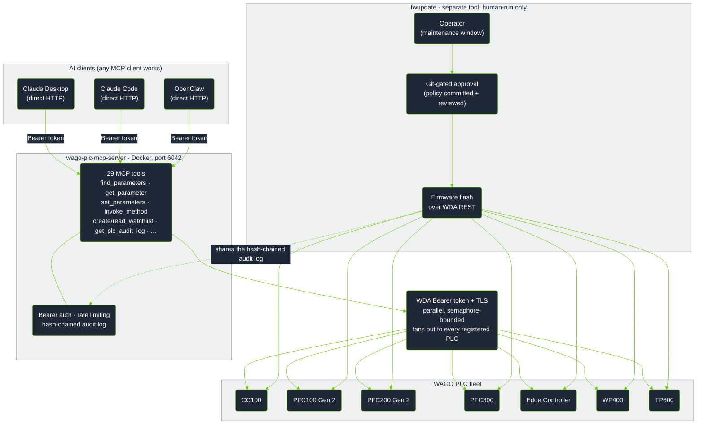
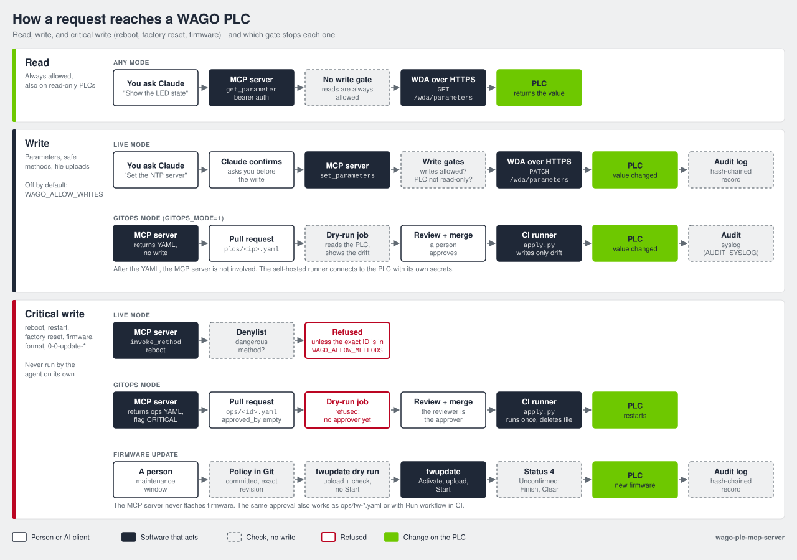

# How it works

This page tells you what the server does on your PLCs and when it allows or refuses a write.

## Architecture

We tested the server with **16 PLCs** of different device classes on one rack.
The parallel fan-out design has no known limit below **100+** PLCs.

Firmware updates are not an MCP tool. See [Firmware updates](firmware-updates.md#firmware-updates).

## What this does and does not do

**WDA (WDx):** Each WAGO PLC has a REST API called WDA (WAGO Device Access).
WDA is for **system and diagnostic management**: firmware version, network settings, service health, status LEDs, reboot, and firmware update.
It is similar to *Online & Diagnostics* in TIA Portal or *Controller Properties* in Studio 5000.
WDA is **not** a fieldbus, **not** OPC UA, and gives **no** access to the I/O data of your control program.

**MCP:** A standard protocol that lets an AI assistant call a fixed set of tools on a system.
This server changes the WDA REST API into 29 tools.

| Term | Meaning | Similar item you know |
|---|---|---|
| WDA / WDx | The WAGO REST API for system and diagnostic management | TIA Portal *Online & Diagnostics*, Studio 5000 *Controller Properties* |
| MCP | A protocol that lets an AI assistant call a fixed set of tools | An API contract that an LLM calls instead of your code |
| Parameter | One named system value, for example firmware version, LED state, or service flag | A diagnostic or status tag, not a control-program I/O tag |
| Method | A remote action, for example NTP sync, reboot, or firmware update | An online action or "execute" command in TIA Portal or Studio 5000 |
| Watchlist | A list of parameters that the PLC keeps open for fast repeated reads | A Watch Table (TIA Portal) or Trend window (Studio 5000) |

> [!IMPORTANT]
> **Limits:**
> - The server supports **WAGO only**. It does not support Siemens S7, Rockwell Logix, or Schneider Modicon.
> - The server does **not** read or write control-program I/O tags, real-time process values, or PLC memory. Use OPC UA, Modbus TCP, or WAGO I/O-Check for field I/O.
> - The server is **not** an HMI or SCADA system. It has no graphical interface.

## Values you can monitor

WDA gives access to the system management layer, not to the real-time process image.
These values are live and are useful to poll:

| Category | Example parameters | Use |
|---|---|---|
| **Service health** | `0-0-ntpclient-isrunning`, `0-0-docker-isrunning`, `0-0-ssh-isrunning`, `0-0-openvpn-isrunning` | Find services that stopped |
| **LED and fault state** | `0-0-ledstates-1-diagnosticinformation` (SYS), `0-0-ledstates-4-diagnosticinformation` (RUN) | Read the status LEDs and diagnostic text without physical access |
| **Firmware update** | `0-0-firmwareupdate-status`, `0-0-firmwareupdate-progress` | Monitor update progress across a fleet |
| **CODESYS runtime** | `0-0-codesys3-applications` | Make sure a PLC program is loaded and running |
| **Cloud connectivity** | `0-0-cloudconnections-1-status-connected`, `0-0-cloudconnections-1-status-filllevel` | Monitor MQTT broker connection and queue level |
| **System time** | `0-0-systemtime-now` | Make sure the clock is correct after an NTP update |

## Supported hardware

| Device | Article numbers | Notes |
|--------|----------------|-------|
| CC100 | `751-9301` · `751-9401` · `751-9402` · `751-9403` | Slow ARM CPU. Set `WAGO_TIMEOUT_SECONDS=45`. |
| CC100-IEC62443 | `751-9412` | Hardened CC100 variant. Same device class. Approximately 1056 WDA parameters instead of 360, because of additional security feature groups. |
| PFC100 Gen 2 | `750-8110` · `750-8111` · `750-8112` · `750-8112/025-000` | |
| PFC200 Gen 2 | `750-8210` · `750-8211` · `750-8212` · `750-8216` · `750-8217` | |
| PFC300 | `750-8302` | |
| PFC400 | `750-8400` | **Not tested.** The server identifies the device class, but we have no hardware to verify it. |
| Edge Controller | `752-8303/8000-0002` | Gives the CODESYS runtime state in `0-0-plcruntime-*` |
| WP400 | `762-34xx` | Web panel only. 189 WDA parameters, no CODESYS. HMI parameters: display brightness, orientation, screensaver, browser start page, touch cleaning mode. |
| TP600 | `762-42xx` · `762-43xx` · `762-52xx` · `762-53xx` · `762-62xx` · `762-63xx` | PLC and HMI. 410 WDA parameters. CODESYS 3, BACnet, cloud, serial, all WP400 HMI parameters, front LED, and acoustic feedback. |

**Firmware:** Build 28 (FW28) or higher is necessary. We tested up to 04.09.01 (FW31).

## Read and write rules

Each agent operation is in one of three classes. There are no other classes.

| Class | Tools | Changes the PLC |
|---|---|---|
| **Read** | `list_plcs`, `describe_plc`, `find_parameters`, `get_parameter`, `get_parameters_bulk`, `find_methods`, `get_method`, `get_method_run`, `create_watchlist`, `read_watchlist`, `delete_watchlist`, `get_plc_audit_log` | No |
| **Write a parameter** | `set_parameters` | Yes. It changes a stored configuration value. |
| **Start a method** | `invoke_method` | Yes. It starts an action, for example NTP sync, reboot, or firmware update. |

The diagram shows the path of each class to the PLC, and the gate that stops it.
A critical write is a dangerous method: reboot, restart, factory reset, firmware, format, or a `0-0-update-*` method.

### Default behavior

The default configuration is live mode with no read-only hosts.

- **Reads:** The server always allows reads. Reads have no side effects.
- **Parameter writes:** The server allows a write if the parameter is writeable. It checks this in its cache before it sends a request to the PLC.
- **Safe methods:** The server runs all methods that are not on the dangerous list.
- **Dangerous methods:** The server refuses method IDs that start with `reboot`, `restart`, `factory`, `firmware`, or `format`. It also refuses all methods of the `update` feature (`0-0-update-*`), which the CC100-IEC62443 uses to flash firmware. To allow one, add its exact ID to `WAGO_ALLOW_METHODS`.

### Decision table

Three conditions control the result. Read-only status has priority. If the PLC is not read-only, the server mode controls the result.

| Condition | Read | `set_parameters` | Safe `invoke_method` | Dangerous `invoke_method` |
|---|---|---|---|---|
| **Read-only PLC** (`WAGO_ALLOW_WRITES` set but not `true`, `WAGO_READONLY_HOSTS`, or `# readonly` in the fleet file), all modes | Allowed | **Refused** | **Refused** | **Refused** |
| **Live mode** (`GITOPS_MODE=0`, default) | Allowed | Allowed if writeable | Allowed | **Refused** if the ID is not in `WAGO_ALLOW_METHODS` |
| **GitOps mode** (`GITOPS_MODE=1`) | Allowed | Returns a YAML fragment for a pull request. No direct write. | Returns a YAML fragment | Returns a YAML fragment with `requires_human: CRITICAL`. `apply.py` does not run it until a person sets `approved_by`. |

The [audit log](security.md#audit-log) records each write and each method call, also when the server refuses it.

## Safety gates

An AI agent can go off-script because of hallucination, prompt injection, or a bug.
On a production line, an unwanted configuration change or reboot can cause equipment damage.
The server enforces these gates in code. **The agent cannot override them.**

| Gate | Function | Configuration |
|------|--------------|-----------|
| **Read-only PLCs** | The listed PLCs refuse all writes, method calls, and file uploads in all modes. | `WAGO_READONLY_HOSTS=ip,ip`, or `# readonly` on the line in the fleet file |
| **Fleet-wide write switch** | Makes all PLCs read-only. If the variable is not set, writes are possible. Any value other than `true` blocks writes, so a typo fails closed. The Claude Desktop extension sets this from its "Allow writes" checkbox, which is off by default. | `WAGO_ALLOW_WRITES=true` allows writes. `WAGO_ALLOW_WRITES=false` blocks them. |
| **Dangerous-method denylist** | In live mode, the server refuses reboot, restart, factory reset, firmware, and format methods, and all `0-0-update-*` methods. | `WAGO_ALLOW_METHODS=<exact-method-id>` allows one method |
| **Human approval for dangerous operations** | In GitOps mode, these operations become a pull request with `requires_human: CRITICAL`. `apply.py` does not run until a person sets `approved_by`. | Set `approved_by` during the review, or set `WAGO_APPROVED_BY` in CI |

For a high-consequence action, use a pull request that a person reviews. The audit log records it.
A refusal is correct behavior, not a failure.
For more details and a dry-run example, see [`docs/gitops/README.md` → Safety model](gitops/reference.md#safety-model---three-independent-gates).
